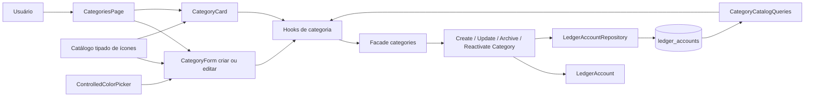
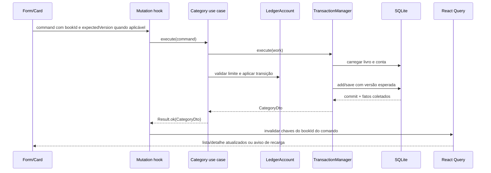

# Metadados Visuais e Gestão de Categorias — Design

**Spec:** `.specs/features/category-management-enhancements/spec.md`
**Contexto:** `.specs/features/category-management-enhancements/context.md`
**Status:** Aprovado em 2026-09-09
**Abordagem confirmada:** 1 — estender `ledger_accounts` e manter `LedgerAccount` como agregado único

---

## Architecture Overview

A feature permanece dentro da arquitetura atual: categorias gerenciáveis continuam sendo contas contábeis `INCOME` ou `EXPENSE` sem `systemPurpose`. O agregado `LedgerAccount` recebe os metadados visuais condicionais `iconKey` e `colorHex`; os contratos públicos específicos de categoria os tornam obrigatórios, enquanto contas financeiras e contas de sistema continuam sem esses campos.

O SQLite recebe duas colunas opcionais no schema compartilhado, mas triggers tornam ambas obrigatórias e válidas apenas para categorias gerenciáveis. Serviços de aplicação dedicados protegem o limite de categoria, a versão otimista e a atomicidade. Na borda Tauri, um formulário reutilizável atende criação e edição, usando React Hook Form, Zod e os campos controlados existentes. A página consulta ambos os estados e filtra localmente por status e tipo.



### Fluxo de escrita



## Approach Selection

| Abordagem | Resultado | Trade-off |
| --- | --- | --- |
| **1. Colunas em `ledger_accounts` — escolhida** | Um agregado, uma versão, um repositório e uma transação para nome, ícone, cor e status. | Exige invariantes condicionais porque o schema também armazena contas não categóricas. |
| 2. Tabela `category_metadata` 1:1 | Separa visual de contabilidade. | Introduz join, sincronização de ciclo de vida e possibilidade de linha ausente para uma entidade que já é tratada como um agregado único. |
| 3. Catálogo visual fora do ledger | Reduz mudanças no repositório contábil. | Divide a categoria entre dois donos, cria versionamento concorrente separado e enfraquece a atomicidade pedida. |

A abordagem 1 foi confirmada pelo usuário. Ela é a única que preserva naturalmente o controle otimista já existente e permite que `UpdateCategory` produza uma única versão e um único fato.

---

## Invariants and Ownership

Uma **categoria gerenciável** é um `LedgerAccount` cujo `kind` é `INCOME` ou `EXPENSE` e cujo `systemPurpose` é ausente. Essa distinção é mais estrita que o helper atual `isCategoryAccount`, que considera apenas o tipo.

As invariantes serão:

1. Categoria gerenciável sempre possui `iconKey` em slug ASCII minúsculo (`^[a-z0-9]+(?:-[a-z0-9]+)*$`) e `colorHex` com seis caracteres (`^[0-9a-f]{6}$`).
2. Conta financeira ou conta de sistema não recebe nem expõe metadados visuais.
3. `kind`, `bookId`, `id`, `systemPurpose` e `status` não mudam em `updateCategory`.
4. Uma alteração real de nome, ícone ou cor incrementa a versão uma vez e registra um único `CategoryUpdated` com o snapshot resultante.
5. Uma atualização idêntica valida a entrada, mas não salva, não incrementa versão e não registra fato.
6. O domínio valida formato e limite de categoria; o SQLite repete as invariantes como defesa contra escritas fora do domínio.
7. A biblioteca concreta de ícones pertence à UI. Domínio e SQLite validam a estabilidade sintática da chave, sem importar componentes React.

---

## Code Reuse Analysis

### Existing Components to Leverage

| Componente/padrão | Local | Uso no desenho |
| --- | --- | --- |
| `LedgerAccount` e fatos de ciclo de vida | `packages/domain/src/ledger/accounts/ledger-account.ts` | Manter o agregado e adicionar aparência condicional e `updateCategory`. |
| `executeUseCase` + `TransactionManager` | `packages/application/src/core/use-case-executor.ts` | Executar validação, save e coleta de fatos na transação existente. |
| Repositório com `expectedVersion` | `packages/infrastructure-sqlite/src/repositories/sqlite-ledger-account-repository.ts` | Persistir os novos campos no mesmo `INSERT`/`UPDATE`. |
| Runner de migração transacional | `packages/infrastructure-sqlite/src/migrations/sqlite-migration-runner.ts` | Aplicar schema, backfill e triggers como migração atômica `0004`. |
| `CategoryCatalogQueries` | `packages/application/src/catalog/catalog-queries.ts` | Estender todos os read models de categoria com aparência obrigatória. |
| `ControlledInput`, `ControlledField` e `ControlledFieldProps` | `apps/tauri/src/components/forms/` | Compor nome, tipo, ícone e o novo adaptador de cor. |
| `income-form.tsx` / `expense-form.tsx` | `apps/tauri/src/features/transactions/components/` | Repetir `zodResolver`, tipos de entrada/saída, bloqueio de submissão e toast. |
| `ColorPicker` compartilhado | `packages/ui/src/components/color-picker.tsx` | Corrigir sincronização controlada e compor uma variante opaca sem renderizar alpha/formato. |
| `Sheet` controlado | `apps/tauri/src/features/categories/components/categories-page.tsx` | Hospedar criação e edição, preservando título e retorno de foco. |
| `Empty`, `Badge`, `ToggleGroup`, `Skeleton` | `packages/ui/src/components/` | Substituir markup ad hoc e manter estados e filtros consistentes. |

### Integration Points

| Sistema | Integração |
| --- | --- |
| Domínio | Aparência é parte condicional do snapshot do mesmo `LedgerAccount`. |
| Aplicação | Commands/DTOs próprios de categoria; casos de uso dedicados para update/archive/reactivate. |
| Memória | Stores continuam clonando snapshots; queries e DTO mappers passam a incluir aparência. |
| SQLite | `icon_key` e `color_hex`, backfill, triggers, mapper, repositório e consultas. |
| Tauri services | `services.categories` deixa de expor rename/lifecycle genéricos e recebe os serviços dedicados. |
| React Query | Invalidação específica cobre gestão, detalhe e os dois seletores por `bookId` do comando. |
| UI | Catálogo resolve string persistida em componente React somente na borda visual. |

---

## Components

### 1. Category appearance domain model

- **Local:** novo `packages/domain/src/ledger/accounts/category-appearance.ts` e alterações em `ledger-account.ts`/exports.
- **Propósito:** centralizar validação canônica sem acoplar o domínio ao catálogo React.
- **Interfaces propostas:**

```ts
export interface CategoryAppearance {
  readonly iconKey: string
  readonly colorHex: string
}

export function categoryAppearance(input: CategoryAppearance): CategoryAppearance
export function isManagedCategoryAccount(account: LedgerAccount): boolean

interface UpdateCategoryInput {
  readonly name: string
  readonly iconKey: string
  readonly colorHex: string
}
```

`categoryAppearance` converte somente letras hexadecimais para minúsculas e rejeita `#`, whitespace, formatos de três/oito dígitos e slugs inválidos. O agregado mantém os campos opcionais estruturalmente porque também representa contas não categóricas, mas oferece `toCategorySnapshot()`/`categoryAppearance` com retorno obrigatório depois de validar o limite. `LedgerAccount.create` e `restore` rejeitam combinações inconsistentes; os casos de criação de categoria fornecem ambos os campos.

`updateCategory(input)` valida todas as entradas antes de alterar estado, compara os valores canônicos, atualiza os três campos juntos e registra `CategoryUpdated` somente quando houver mudança. `archive()` e `reactivate()` continuam sendo transições do agregado; os novos serviços garantem que apenas categorias gerenciáveis chegam a elas.

### 2. Category application contracts and use cases

- **Locais:** `packages/application/src/ports/commands.ts`, `ports/events.ts`, `catalog/catalog-queries.ts`, `ledger/accounts/`, `index.ts` e testes públicos.
- **Commands:**

```ts
interface CreateCategoryCommand {
  readonly bookId: string
  readonly name: string
  readonly kind: "INCOME" | "EXPENSE"
  readonly iconKey: string
  readonly colorHex: string
}

interface UpdateCategoryCommand {
  readonly bookId: string
  readonly categoryId: string
  readonly expectedVersion: number
  readonly name: string
  readonly iconKey: string
  readonly colorHex: string
}

interface ArchiveCategoryCommand {
  readonly bookId: string
  readonly categoryId: string
  readonly expectedVersion: number
}

interface ReactivateCategoryCommand extends ArchiveCategoryCommand {}

interface CategoryDto {
  readonly id: string
  readonly bookId: string
  readonly name: string
  readonly kind: "INCOME" | "EXPENSE"
  readonly status: "ACTIVE" | "ARCHIVED"
  readonly iconKey: string
  readonly colorHex: string
  readonly version: number
}
```

`CreateIncomeCategory` e `CreateExpenseCategory` retornam `CategoryDto`. `UpdateCategory`, `ArchiveCategory` e `ReactivateCategory` compartilham funções internas para carregar livro/conta, validar pertencimento, categoria gerenciável e versão. Os genéricos `RenameLedgerAccount`, `ArchiveLedgerAccount` e `ReactivateLedgerAccount` permanecem disponíveis apenas no facade de contas.

Ordem de `UpdateCategory`: parse IDs → carregar livro → carregar conta → validar mesmo livro → validar categoria gerenciável → validar versão → validar/normalizar aparência e nome → consultar duplicidade excluindo o próprio ID → aplicar `updateCategory` → salvar somente se a versão mudou → mapear `CategoryDto`.

`CategoryUpdated` entra em `ApplicationEventType` e na allowlist do dispatcher. Seu payload contém `bookId`, nome, `normalizedName`, kind, status, `iconKey` e `colorHex` resultantes. Os fatos de archive/reactivate permanecem os fatos contábeis já existentes.

### 3. SQLite migration and persistence

- **Migração:** novo `packages/infrastructure-sqlite/migrations/0004_category_visual_metadata.sql` e regeneração de `generated-migrations.ts` pelo script do pacote.
- **Schema:** adicionar `icon_key TEXT` e `color_hex TEXT` como colunas nullable, pois a tabela também contém contas não categóricas.
- **Backfill:**
  - `INCOME` sem `system_purpose`: `label-dollar`, `10b981`;
  - `EXPENSE` sem `system_purpose`: `label-dollar`, `f43f5e`;
  - demais linhas: ambos permanecem `NULL`.
- **Triggers:** `BEFORE INSERT` e `BEFORE UPDATE OF kind, system_purpose, icon_key, color_hex` rejeitam:
  - categoria gerenciável com qualquer campo nulo, vazio ou fora do formato;
  - conta não gerenciável com qualquer metadado visual presente.

A validação hexadecimal usa comprimento seis e ausência de caracteres fora de `[0-9a-f]`; a validação do slug usa caracteres minúsculos alfanuméricos e hífen, rejeitando início/fim com hífen e `--`. O arquivo inteiro roda dentro da transação por migração já oferecida pelo runner.

`LedgerAccountMapper` passa a ler/escrever as colunas e aplica a mesma combinação condicional antes de restaurar o agregado. `SqliteLedgerAccountRepository` inclui os campos em todos os `SELECT`, no `INSERT` e no `UPDATE` protegido por versão. `SqliteCategoryCatalogQueries` seleciona e valida os campos em listagens de receita, despesa, gestão e detalhe. Linha categórica corrompida falha explicitamente na leitura; chave sintaticamente válida mas ausente do bundle é tratada pelo fallback da UI.

### 4. Typed icon registry and selector

- **Local:** refatorar `apps/tauri/src/components/category-icons/index.tsx`; novo seletor específico em `features/categories/components/`.
- **Fonte única:**

```ts
export const categoryIconsLibrary = {
  aeroplane: Aeroplane,
  // ...
  "label-dollar": LabelDollar,
} as const satisfies Record<string, CategoryIconComponent>

export type CategoryIconName = keyof typeof categoryIconsLibrary
export const categoryIconNames = Object.keys(categoryIconsLibrary) as readonly CategoryIconName[]
export const categoryIconEntries = Object.entries(categoryIconsLibrary) // helper tipado
```

O objeto oferece lookup direto O(1); nomes e entries são derivados uma vez, em ordem de declaração determinística. `getCategoryIconOrFallback` resolve chaves desconhecidas para `label-dollar`. Helpers retornam coleções readonly/cópias para impedir mutação externa. A lista manual paralela é removida.

Como a biblioteca possui dezenas de opções, o seletor não usa `ToggleGroup`, adequado apenas ao tipo binário. Ele usa um grupo de radios nativos estilizados em grid, integrado por `Controller` e envolvido por `ControlledField`. Cada opção expõe nome acessível, `checked`, foco visível e o componente já resolvido. O valor submetido permanece a chave textual.

### 5. Opaque controlled color field

- **Locais:** corrigir `packages/ui/src/components/color-picker.tsx`; criar `apps/tauri/src/components/forms/controlled-color-picker.tsx` e exportá-lo pelo barrel de forms, se houver.
- **Contrato:** `ControlledColorPicker<TValues, TOutput = TValues>` estende `ControlledFieldProps<TValues, string, TOutput>`.

O campo usa `Controller`, delega layout/erro/descrição/disabled a `ControlledField` e trata React Hook Form como fonte de verdade. A composição renderiza `ColorPickerSelection`, `ColorPickerHue`, preview, conta-gotas e uma entrada hexadecimal acessível; não renderiza `ColorPickerAlpha`, seletor de formato nem percentual alpha.

O adaptador converte o tuple RGB emitido pelo picker para `rrggbb` minúsculo e descarta qualquer alpha. A entrada manual não remove `#` nem corrige comprimentos; ela preserva o texto para que Zod mostre erro. Somente uma cor RGB válida é enviada ao picker visual. `reset`/mudança externa atualiza HSL a partir do valor controlado sem disparar um `onChange` divergente. Disabled é propagado a seleção, hue, conta-gotas e entrada.

No componente compartilhado, a sincronização controlada deve converter `value` por `Color(value).hsl().object()`; os canais RGB nunca podem ser atribuídos a hue/saturation/lightness. A notificação ao pai deve ignorar emissões equivalentes ao valor controlado para evitar eco e dirty state falso.

### 6. Shared category form

- **Locais:** `category-form.tsx`, `category-form-model.ts` e componentes auxiliares.
- **API proposta:**

```ts
type CategoryFormProps =
  | { mode: "create"; initialCategory?: never; onSuccess(id: string): void; onCancel(): void }
  | { mode: "edit"; initialCategory: CategorySummary; onSuccess(id: string): void; onCancel(): void }
```

Um schema Zod comum valida `name`, `kind`, `iconKey` e `colorHex`; a saída transforma nome por `trim()` e cor por `toLowerCase()`. O formulário usa `zodResolver` diretamente, `mode: "onSubmit"` e `reValidateMode: "onChange"`, eliminando `safeParse` e regras duplicadas.

Defaults de criação: nome vazio, `EXPENSE`, `label-dollar`, `f43f5e`. Edição usa o snapshot carregado e mostra o tipo como texto/Badge, sem registrá-lo em um controle mutável. O nome usa `ControlledInput`; tipo usa `Controller` + `ControlledField` + `ToggleGroup`; ícone usa o radio grid dentro de `ControlledField`; cor usa `ControlledColorPicker`. Todos ficam em `FieldGroup` e recebem o mesmo `disabled` derivado de submit/mutation/conflict.

O submit cria exatamente um command. Em edição, inclui `categoryId` e `expectedVersion`. Uma trava por ref impede segundo envio durante a janela entre clique e atualização de estado. Falha gera um único `toast.add`, preserva valores e mantém o Sheet aberto. Conflito bloqueia novo submit, invalida/recarrega o detalhe e exige fechar/reabrir ou acionar novamente a edição a partir do dado atualizado.

### 7. Category facade, hooks and cache consistency

- **Facade:** `services.categories` expõe `createIncome`, `createExpense`, `update`, `archive`, `reactivate`, além das queries; remove `rename` do escopo de categorias.
- **Hooks:** criação passa a usar `CategoryDto`; lifecycle passa a aceitar `categoryId`. Um hook/função dedicado `invalidateCategoryQueries` invalida, pelo `bookId` do command:
  - `categoryKeys.all(bookId)` com prefix match, cobrindo lista e detalhe;
  - `categoryKeys.incomeCategories(bookId)` exato;
  - `categoryKeys.expenseCategories(bookId)` exato.

As invalidações usam `Promise.allSettled`. Depois que o serviço retorna sucesso, falha de refresh não converte o resultado em falha de persistence: o hook mantém o `CategoryDto` bem-sucedido e retorna/sinaliza `refreshWarning`, exibindo toast com orientação para recarregar. Assim, troca de livro não direciona a invalidação ao livro atualmente ativo por engano.

Para edição com conflito, o detalhe específico é invalidado e o formulário entra em estado bloqueado. Archive/reactivate desabilitam a ação enquanto pendentes e enviam uma mutation por gesto.

### 8. Categories page and cards

- **Consulta:** `CategoriesPage` usa `useCategories(true)`.
- **Estado local:** `statusFilter: "ACTIVE" | "ARCHIVED"` inicia em `ACTIVE`; `typeFilter: "ALL" | "INCOME" | "EXPENSE"` inicia em `ALL`.
- **Filtros:** dois `ToggleGroup` exclusivos e controlados, com labels acessíveis e exatamente um valor em cada grupo.
- **Cards:** resolvem `iconKey` no registry e aplicam `#${colorHex}` por custom property/estilo inline somente ao filete e ao stroke do ícone. Nome e `Badge` de tipo permanecem textuais. Chave desconhecida usa fallback sem remover ações.
- **Ações:** ativo oferece `Editar <nome>` e `Arquivar <nome>`; arquivado oferece `Editar <nome>` e `Reativar <nome>`. Erros são toasts, não alertas persistentes dentro do card.
- **Panels:** criação e edição usam Sheets controlados separados ou um controller discriminado (`closed | create | edit(categoryId)`). Ambos têm `SheetTitle`; o trigger é preservado para retorno de foco. Durante submit de edição, cancelamento do formulário fica desabilitado.
- **Estados:** loading usa Skeleton; falha usa Alert + retry; combinação vazia usa `Empty` mantendo filtros visíveis e oferece criação na visão ativa. A visão arquivada não sugere recriar uma categoria arquivada.
- **Troca de livro:** um efeito observa o `bookId`, fecha qualquer Sheet, limpa o ID/versão selecionados e deixa as query keys carregarem o novo livro.

---

## Data Models

### Domain snapshot

```ts
interface LedgerAccountSnapshot {
  readonly id: LedgerAccountId
  readonly bookId: BookId
  readonly name: string
  readonly normalizedName: string
  readonly kind: LedgerAccountKind
  readonly status: LedgerAccountStatus
  readonly systemPurpose?: SystemAccountPurpose
  readonly iconKey?: string
  readonly colorHex?: string
  readonly version: number
}

interface ManagedCategorySnapshot extends LedgerAccountSnapshot {
  readonly kind: "INCOME" | "EXPENSE"
  readonly systemPurpose?: never
  readonly iconKey: string
  readonly colorHex: string
}
```

O tipo amplo representa a tabela compartilhada; `ManagedCategorySnapshot` é o contrato refinado retornado somente depois de `assertManagedCategory`.

### Read models

`ExpenseCategorySummary`, `IncomeCategorySummary` e `CategorySummary` recebem `iconKey` e `colorHex` obrigatórios. `CategoryDto` acrescenta `bookId` ao shape de mutation. `AccountDto` não muda.

### SQLite row

```sql
icon_key TEXT NULL,
color_hex TEXT NULL
```

Não há índice novo: as colunas são payload visual, não critérios de lookup. O lookup de ícone ocorre no objeto em memória, não no banco.

---

## Error Handling Strategy

| Cenário | Camada e código | Comportamento da UI |
| --- | --- | --- |
| Nome vazio | Zod / `INVALID_ACCOUNT_NAME` | Erro junto ao nome; sem mutation. |
| Tipo inválido na criação | Zod / `INVALID_ACCOUNT_KIND` | Erro junto ao tipo; sem mutation. |
| Ícone vazio/slug inválido | Zod / erro de domínio | Erro junto ao seletor; sem persistência. |
| Cor não canônica | Zod / erro de domínio | Erro junto à cor; valor manual preservado. |
| Nome duplicado no mesmo livro/tipo | `DUPLICATE_ENTITY` | Toast traduzido; Sheet permanece aberto. |
| Livro/entidade ausente ou diferente | `ENTITY_NOT_FOUND` / `BOOK_MISMATCH` | Toast neutro, sem detalhes internos. |
| Conta financeira/sistema como alvo | `INVALID_ACCOUNT_KIND` / `SYSTEM_ACCOUNT_PROTECTED` | Toast informando que o item não pode ser alterado. |
| Versão divergente | `OPTIMISTIC_CONCURRENCY_FAILURE` | Toast, refresh do detalhe e submit bloqueado até nova ação. |
| Falha SQLite antes do commit | transação rollback | Toast; lista e formulário permanecem no estado anterior. |
| Falha ao invalidar cache após commit | resultado de `allSettled` | Mutation continua bem-sucedida; toast orienta recarregar. |
| Falha de query | Result/query error | Alert com retry; nunca renderizar como lista vazia. |
| Chave válida mas ausente no bundle | fallback de registry | `label-dollar`; nome, tipo e ações continuam presentes. |

As mensagens são centralizadas em `categoryErrorMessage(error, action)` e mapeiam somente códigos conhecidos. Mensagens internas de SQLite/domínio não são interpoladas no toast.

---

## Validation and Test Strategy

### Automated layers

| Camada | Evidência esperada |
| --- | --- |
| Domínio | criação/restauração condicional, canonicalização, rejeições, update unitário, no-op, fatos e proteção de contas de sistema. |
| Aplicação + memória | commands/DTOs, duplicidade, livro, categoria gerenciável, versão, atomicidade, serviços dedicados e exports. |
| Migração SQLite | backfill por tipo, contas não categóricas nulas, triggers insert/update, rollback e migrations geradas sincronizadas. |
| Mapper/repositório SQLite | round trip dos campos, CAS, no-op, corruption handling e contratos completos. |
| Queries SQLite/memória | appearance em receita, despesa, gestão e detalhe; ordenação/status preservados. |
| Registry/UI primitives | unicidade/ordem/fallback/lookup, sincronização RGB↔HSL, alpha descartado e `ControlledColorPicker` reset/error/disabled. |
| Hooks | payload único, chaves por livro, três famílias de cache, partial refresh e conflito. |
| Form/page/card | defaults, create/edit, campos controlados, filtros compostos, ações por status, empty/error/loading e troca de livro. |
| Acessibilidade/UAT | teclado em radios/filtros, labels/selected state, foco do Sheet, cor/fallback e contraste sem depender só de cor. |

### Requirement coverage

| Requisitos | Cobertura de design |
| --- | --- |
| CAT-01, CAT-02, CAT-03, CAT-04, CAT-05, CAT-06, CAT-07, CAT-08, CAT-09, CAT-10, CAT-70 | Invariantes, modelo de domínio, migração, mapper e repository. |
| CAT-11, CAT-12, CAT-13, CAT-14, CAT-15, CAT-16 | Registry tipado, helpers derivados, lookup direto, estabilidade e boundary React. |
| CAT-17, CAT-18, CAT-19, CAT-20, CAT-21, CAT-22, CAT-23, CAT-24, CAT-25, CAT-26, CAT-27, CAT-28 | Schema/RHF, defaults, quatro campos, opacidade, submit, pending, toast e ausência de livro. |
| CAT-29, CAT-30, CAT-31, CAT-32, CAT-33, CAT-34, CAT-35, CAT-36, CAT-37, CAT-38, CAT-71 | `UpdateCategory`, serviços dedicados, CAS, duplicidade, atomicidade, no-op e fato único. |
| CAT-39, CAT-40, CAT-41, CAT-42, CAT-43, CAT-44, CAT-45, CAT-46 | Form compartilhado, Sheet de edição, tipo imutável, conflito e refresh. |
| CAT-47, CAT-48, CAT-49, CAT-50, CAT-51, CAT-52, CAT-53, CAT-54, CAT-55, CAT-56, CAT-57 | Query com arquivadas, filtros compostos, ações, reativação e estados da página. |
| CAT-58, CAT-59, CAT-60, CAT-61, CAT-62, CAT-63 | Card visual, fallback, texto redundante, teclado, nomes e foco. |
| CAT-64, CAT-65, CAT-66, CAT-67, CAT-68, CAT-69 | Troca de livro, cache pelo command, falha parcial, conta-gotas/manual e retry versionado. |
| CAT-72, CAT-73, CAT-74, CAT-75, CAT-76, CAT-77, CAT-78, CAT-79 | Reuso dos controlled fields e contrato completo de `ControlledColorPicker`. |

### Gate commands planned for Execute

```sh
pnpm --filter @workspace/domain test
pnpm --filter @workspace/domain check-types
pnpm --filter @workspace/application test
pnpm --filter @workspace/application check-types
pnpm --filter @workspace/infrastructure-memory test
pnpm --filter @workspace/infrastructure-sqlite generate:migrations
pnpm --filter @workspace/infrastructure-sqlite check:migrations
pnpm --filter @workspace/infrastructure-sqlite test
pnpm --filter @workspace/infrastructure-sqlite check-types
pnpm --filter @workspace/ui test
pnpm --filter @workspace/ui typecheck
pnpm --filter tauri exec vitest run
pnpm --filter tauri exec tsc --noEmit
pnpm --filter tauri exec eslint . --max-warnings 0
```

O Execute deverá separar falhas preexistentes de regressões introduzidas e realizar UAT em runtime Tauri/browser para os fluxos visuais e de foco; testes jsdom não substituem essa evidência.

---

## Risks & Concerns

| Concern | Location (file:line) | Impact | Mitigation |
| --- | --- | --- | --- |
| A lista de nomes e o objeto de ícones são mantidos separadamente. | `apps/tauri/src/components/category-icons/index.tsx:55` e `:114` | Uma nova opção pode existir em apenas uma coleção, quebrando listagem ou resolução. | Tornar o objeto a fonte única e derivar names/entries. |
| A sincronização controlada atribui canais RGB a HSL. | `packages/ui/src/components/color-picker.tsx:83` | Initial value/reset podem exibir outra cor e emitir valor divergente. | Converter por HSL, testar reset e suprimir eco equivalente. |
| O lifecycle de categoria usa commands/DTO de conta e cast do handler. | `apps/tauri/src/features/categories/hooks/use-category-lifecycle.ts:13` | O boundary aceita contas não categóricas e perde segurança de tipo. | Commands, DTOs, serviços e hooks específicos de categoria, sem cast. |
| O facade de categorias reutiliza rename/archive/reactivate genéricos. | `apps/tauri/src/bootstrap/create-services.ts:62` e `:178` | Uma conta financeira pode atravessar a API de categorias. | Substituir somente nesse facade pelos três casos de uso dedicados. |
| A invalidação genérica cobre apenas o prefixo de gestão. | `apps/tauri/src/features/query-invalidation.ts:138` e `apps/tauri/src/features/categories/hooks/category-keys.ts:5` | Seletores de transação podem manter nome/status/aparência obsoletos. | Invalidador de categoria cobre gestão/detalhe e ambas as keys de selector. |
| `Promise.all` transforma falha de refresh pós-commit em rejection da mutation. | `apps/tauri/src/features/categories/hooks/use-create-expense-category.ts:17` | A UI pode informar que a criação falhou embora já esteja persistida. | `allSettled` e warning separado do resultado persistido. |
| A página solicita somente ativas e o model fixa `ACTIVE`. | `apps/tauri/src/features/categories/components/categories-page.tsx:101` e `category-list-model.ts:18` | Categorias arquivadas permanecem invisíveis. | Consultar com `true` e compor filtros explícitos de status/tipo. |
| Cards usam cores e ícones fixos pelo tipo. | `apps/tauri/src/features/categories/components/category-card.tsx:13` | Metadados persistidos não aparecem e cor continua sendo o principal sinal. | Resolver registry, custom property para cor e manter nome/Badge textual. |
| Trigger SQLite inválido vira `UNEXPECTED_ERROR`. | `packages/infrastructure-sqlite/src/database/sqlite-error.ts:23` | Uma escrita inválida direta não produz mensagem específica. | Validar no Zod/domínio antes do SQL; trigger é defesa final e mensagem interna nunca chega à UI. |
| Fatos são publicados após o commit. | `packages/application/src/core/use-case-executor.ts:13` | Um publisher arbitrário que rejeite pode fazer um comando parecer falho após persistir. | Manter o padrão do sistema; o publisher Tauri isola erro de listeners. Testar rollback/fatos antes do commit e tratar refresh/eventos de UI sem reverter sucesso persistido. Uma garantia transacional de entrega externa exigiria outbox e fica fora desta feature. |
| Os novos ícones e ColorPicker são alterações locais ainda não integradas ao fluxo. | `apps/tauri/src/components/category-icons/` e `packages/ui/src/components/color-picker.tsx` | Implementação pode sobrescrever trabalho existente ou assumir API ainda sem testes. | Tratar os arquivos atuais como baseline, aplicar mudanças cirúrgicas e adicionar testes antes da composição final. |

---

## Tech Decisions

| Decisão | Escolha | Rationale |
| --- | --- | --- |
| Persistência da aparência | Colunas condicionais no mesmo `ledger_accounts`. | Mantém aggregate/version/repository/transação únicos. |
| Regra de obrigatoriedade | Domínio + mapper + triggers SQLite. | Segurança em todas as entradas sem tornar campos obrigatórios para contas não categóricas. |
| Conhecimento do catálogo | Somente a UI conhece chaves concretas. | Evita dependência React no domínio; chaves continuam validadas como slug estável. |
| Registry | Objeto readonly tipado como fonte única. | Lookup direto, derivação simples e ausência de drift entre coleções. |
| Seletor de dezenas de ícones | Radio group nativo em grid. | Semântica e teclado adequados para seleção única; `ToggleGroup` fica apenas nas escolhas pequenas. |
| Valor de cor entre camadas | `rrggbb` minúsculo; `#` apenas no CSS/picker. | Representação canônica, opaca e igual no form, command e SQLite. |
| Edição | Um `UpdateCategory` para nome + ícone + cor. | Um CAS, uma transação, uma versão e um fato. |
| Lifecycle | Serviços dedicados no facade de categorias. | Garante o limite de entidade sem remover APIs genéricas de contas. |
| Invalidação pós-mutation | `allSettled` e warning separado. | Cache pode falhar sem reinterpretar persistência concluída como falha. |
| Filtro de arquivadas | Uma query por livro, filtros locais de status/tipo. | Dataset local pequeno, troca imediata e sem nova rota/contrato remoto. |

Estas decisões são locais à feature e não criam, por enquanto, uma convenção de projeto que exija novo `AD-NNN` em `.specs/STATE.md`.

---

## Approval Gate

Design aprovado pelo usuário em 2026-09-09. A decomposição executável fica em `tasks.md`; a implementação depende da aprovação desse novo artefato.
