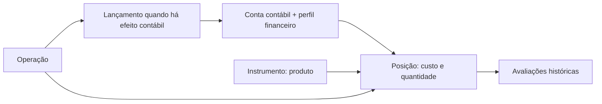

# Análise da proposta de investimentos

Data: 2026-09-10. Escopo: análise e Specify. Nenhuma implementação autorizada nesta etapa.

A proposta é compatível com o ledger atual, mas os textos fornecidos ainda não constituem um contrato de implementação fechado. A separação entre conta, instrumento, posição, avaliação e operação é adequada. O maior trabalho está nas regras que mantêm esses conceitos consistentes e na experiência completa de cadastro, acompanhamento e correção.

## Referências fornecidas

Foram analisados os três anexos, na ordem apresentada:

- “Analisei principalmente `packages/domain`...” (`27f34813-d287-4519-9b28-5d36d0e7a662`): exploração arquitetural e integração futura.
- “Sim. Agora vale congelar um modelo...” (`d26827d0-bdde-44e1-9dfb-bc8d1b2b0e40`): revisão dos aggregates e perfis de conta.
- “A especificação abaixo já está estruturada...” (`79a2aecb-8243-4d8b-a3ed-500e16208e09`): foundation técnica, comandos e matriz de operações.

Os anexos são contexto, não decisões previamente aprovadas pelo usuário. Em divergências, a spec desta pasta explicita a interpretação proposta.

Foi analisado também o refinamento “Li `spec.md`, `context.md` e `analysis.md`...” (`3165069a-ada7-4f1a-954f-f2d00c7adcf4`), apresentado pelo usuário como possível solução para A6, A8, A10 e A12. Sua avaliação está na seção de revisão abaixo.

## O que manter

| Proposta | Avaliação |
| --- | --- |
| Preservar os cinco tipos contábeis | Investimento continua ASSET; tipo de produto é uma dimensão própria. |
| Perfis de FinancialAccount e InvestmentAccount no LedgerAccount | A revisão do segundo texto aproveita identidade, versão e lifecycle existentes. Evita três donos concorrentes do mesmo saldo. |
| Separar instrumento de posição | Permite duas caixinhas/contratações com o mesmo produto e condições diferentes. |
| Taxa e vencimento na posição | Representam os termos daquela contratação; não exigem motor de cálculo de rendimentos. |
| Avaliação histórica sem lançamento | Preserva a diferença entre ganho observado e realizado. |
| Operação com JournalEntry opcional | Compra com caixa interno altera alocação; ganho realizado e movimento entre contas têm efeito contábil. |
| Money em bigint; quantidade e taxa em decimal exato | Preserva precisão sem tratar cotas como centavos. |
| IDs externos fora do domínio | Permite uma futura tradução de fornecedores para contratos próprios. |

As setas representam relações conceituais, não imports. O domínio não depende de SQLite; a infraestrutura implementa os ports da aplicação.

## Lacunas e ajustes necessários

| Lacuna dos textos | Consequência | Decisão proposta na spec |
| --- | --- | --- |
| UI aparece apenas como última etapa | A foundation pode terminar sem entregar a tela pedida | P1 inclui cadastro, operações, leitura, feedback e persistência após reiniciar. |
| “Disponível” não tem fórmula | O usuário continua confundindo patrimônio com dinheiro para o dia a dia | Separar contas de uso diário, caixa da carteira, custo alocado e patrimônio avaliado. |
| NetWorth ora é alterado, ora adiado | Risco de dupla contagem ou mudança silenciosa de contrato | Preservar GetNetWorth contábil e acrescentar resumo patrimonial explícito nesta entrega. |
| netCashFlow diz ter perspectiva da conta, mas compra externa usa sinal negativo | Confunde caixa interno, aporte externo e variação do ledger | Fluxo da operação é pagamento/recebimento pela posição; transferências e delta contábil são campos/conceitos distintos. |
| proceeds, lucro líquido, taxas e impostos não têm composição fechada | Despesa pode ser deduzida duas vezes | Informar bruto; calcular líquido; reconhecer ganho bruto e despesas separadamente. |
| Quantidade é opcional na posição e obrigatória em toda compra/resgate | Renda fixa sem cotas exige inventar quantidade | Modo por quantidade ou por valor, fixado na abertura. |
| Última avaliação não verifica mudança da posição | Venda parcial pode manter valor da posição inteira | Vincular avaliação à revisão de alocação; mudança de custo/quantidade invalida sua aplicação ao saldo atual. |
| Abrir posição com custo não define contrapartida | Pode criar patrimônio sem lastro ou duplicar saldo inicial | Separar alocação de saldo já registrado de compra/aplicação; saldo ausente usa fluxo explícito de saldo inicial. |
| Caixa não alocado é chamado de reconciliationGap | Sem observação independente de caixa não há reconciliação comprovada | Exibir caixa calculado; negativo é diagnóstico. Não inventar gap igual a zero. |
| Reverter qualquer operação e impedir reabertura | Uma venda total não pode ser corrigida; compras antigas podem tornar saldo negativo | Correção da última operação efetiva, transacional, com recomposição do estado e reabertura auditada quando necessária. |
| Tipos TRANSFER/ADJUSTMENT sem matriz completa | A API permite comportamentos financeiros não definidos | Transferência de dinheiro usa o fluxo existente; transferência de custódia e ajuste arbitrário ficam fora. |
| Multimoeda nativa sem regra de consolidação | Soma de BRL e USD deixa de ter significado | Toda a v1 usa moeda-base, inclusive instrumento; FX fica para outra feature. |
| Preparar integração parece garantir sincronização simples | Duplicatas, exclusões, custódia e falta de histórico continuam sem solução | Preparar fronteiras e idempotência local; não prometer compatibilidade integral com provider. |

Caixinha/cofrinho é um nome comercial, não uma espécie universal de ativo. O usuário seleciona o produto real; quando desconhecido, usa OTHER. Não classificar por substring do nome.

## Confronto com o código atual

Os caminhos abaixo foram inspecionados nesta análise; são pontos de impacto, não uma lista de tarefas aprovada.

| Evidência local | Implicação |
| --- | --- |
| `packages/domain/src/ledger/accounts/ledger-account.ts` | LedgerAccount já controla identidade, lifecycle, versão e metadados específicos de categorias. Perfis financeiros precisam preservar esses contratos. |
| `packages/domain/src/shared/money.ts` | Money faz aritmética com bigint. Não há Decimal no domínio atual. |
| `packages/domain/src/ledger/journal/journal-entry.ts` | JournalEntry suporta múltiplos postings e lineage. Reversão não pode ser contada duas vezes ao reconstruir projeções. |
| `packages/application/src/ports/commands.ts` | CreateFinancialAccount recebe kind; JournalBusinessDraft cobre apenas saldo inicial, receita, despesa e transferência. A edição atual não cobre uma venda com custos e impostos. |
| `packages/application/src/ledger/accounts/archive-ledger-account.ts` | Arquivamento ainda não consulta posições, caixa residual ou dependentes de liquidação. |
| `packages/application/src/core/use-case-executor.ts` | Dispatch ocorre depois do commit dentro do mesmo try. Uma falha de publicação pode retornar erro após persistir; investimentos precisam de retry idempotente e estado salvo verificável. |
| `packages/application/src/core/event-dispatcher.ts` | Tipos de evento possuem lista explícita. Novos facts exigem wiring correspondente. |
| `packages/infrastructure-sqlite/src/queries/sqlite-insight-queries.ts` | NetWorth soma saldos contábeis; receitas/despesas são lidas dos postings. Não substituir por soma de posições. |
| `packages/infrastructure-sqlite/src/queries/sqlite-journal-view-queries.ts` | Classificação atual prioriza presença de INCOME/EXPENSE. Lançamentos mistos precisam ser identificados como investimento; totais não podem depender de uma única classificação por linha. |
| `packages/infrastructure-sqlite/src/transaction/sqlite-transaction-manager.ts` | Contexto transacional e coleta de facts já existem; operações compostas devem usar a mesma transação. |
| `packages/infrastructure-sqlite/src/migrations/sqlite-migration-runner.ts` | Migrações são contíguas, verificam checksums e aplicam uma transação por migration. “0005–0009” é previsão, não contrato permanente de numeração. |
| `apps/tauri/src/bootstrap/create-services.ts` | Facade/composição precisa expor os novos casos de uso e queries. |
| `apps/tauri/src/routes/app-routes.tsx` e `apps/tauri/src/layout/app-shell.tsx` | Não há rota/item de investimentos. Dashboard atualmente aponta para CategoriesPage; esta feature não deve virar uma reconstrução do dashboard. |
| `apps/tauri/src/features/accounts/components/account-summary-model.ts` | Resumo atual é derivado localmente da lista de contas e usa fallback BRL. Novo resumo precisa receber agregados e moeda do livro, inclusive vazio. |
| `apps/tauri/src/features/transactions/components/transaction-overlay.tsx` | Fluxos transacionais usam Drawer e fecham ao trocar livro; novo fluxo deve preservar isolamento e interação equivalente. |

O worktree estava limpo no início. `.specs/STATE.md` não existe neste checkout; nenhuma decisão foi atribuída a esse arquivo. O carregamento de lições da skill retornou zero lições confirmadas.

## Verificação externa limitada à integração futura

As páginas oficiais consultadas em 2026-09-10 confirmam que a Pluggy oferece identificação, quantidade, valores bruto/líquido e campos opcionais de investimentos, além de um recurso separado de transações. Isso sustenta a separação local; não define a política contábil do My Fin. Fontes: [Investment](https://docs.pluggy.ai/docs/investments) e [Investment's Transactions](https://docs.pluggy.ai/docs/investment-transactions).

A cobertura varia por instituição e produto. Portanto, operar manualmente sem rede é parte da entrega; presença de uma futura conexão não poderá significar histórico ou campos completos. Fonte: [Investments coverage](https://docs.pluggy.ai/docs/investments-coverage).

Não havia ferramenta Context7 disponível. Nenhuma biblioteca nova foi escolhida nesta fase. Contratos de SDK, Open Finance e desenho de sincronização não foram tratados como requisitos verificados.

## Recomendação

Adotar os perfis de conta da segunda resposta e o núcleo da terceira, incorporando os comportamentos fechados em [spec.md](./spec.md). Revisar primeiro as premissas de produto. Após aprovação, produzir Design e Tasks, incluindo a matriz de efeitos contábeis como oráculo de testes. A entrega só estará implementada após os gates, o verificador independente e a evidência de uso no Tauri.

## Revisão da solução para A6, A8, A10 e A12

A solução é coerente com as fórmulas propostas e foi incorporada aos requisitos. Ela torna explícitos fatos que não devem depender da implementação: custo de alocação não é fiscal, revisão econômica não é versão de concorrência, reversão usa efeitos históricos persistidos e cadastro inicial depende de onde o patrimônio já está contabilizado.

| Ponto | Avaliação e tratamento |
| --- | --- |
| Taxas e impostos | Manter separados do custo, inclusive na compra. Se retidos na mesma liquidação, ficam na própria operação. A linha INCOME foi ajustada para comportar bruto e retenções no mesmo journal, removendo a exigência anterior de sempre registrar FEE/TAX separados. Pagamento posterior continua como evento independente. |
| allocationRevision | Persistir na posição e em cada avaliação, iniciando em 1. Incrementar uma vez por mudança econômica final confirmada. Uma venda e seu cancelamento são dois comandos e produzem revisões 2 e 3. |
| Amendment sem alteração econômica | O anexo condiciona incremento à mudança do estado final. Logo, corrigir descrição, bruto ou taxa conservando custo/quantidade não incrementa a revisão; estados intermediários de reversão/substituição não devem invalidar avaliações por si sós. Datas corrigidas ainda podem invalidar sua elegibilidade temporal. |
| Avaliação concorrente | Ler a revisão apenas na hora de salvar pode atribuir a uma posição já reduzida um valor digitado antes da venda. Acrescentar expectedAllocationRevision e comparar na transação; não atribuir silenciosamente o valor à revisão nova. |
| Inversão histórica | Persistir efeitos da operação e inverter postings originais, sem executar a regra de negócio atual como se a compra/venda original estivesse sendo criada novamente. Guards de integridade permanecem; caixa negativo gera aviso conforme A11 confirmada posteriormente. |
| Estado intermediário do amendment | Validar custo/quantidade restaurados, mas calcular o aviso de caixa sobre o resultado final da transação. Uma reversão intermediária não é uma operação confirmada isoladamente. |
| Lineage independente | Aceitar original sem journal e substituta com journal, e vice-versa. Não criar lançamentos vazios nem IDs contábeis fictícios para imitar a cadeia da operação. |
| Saldo inicial | A separação em três origens evita transferir patrimônio duas vezes. `SetOpeningBalance` existente consulta `findActiveOpeningBalanceByAccount` e retorna OPENING_BALANCE_ALREADY_SET. O fluxo preserva esse guard e permite correção explícita do lançamento existente. |
| Book value inicial | Custo 10.000 e valor observado 11.500, sem caixa real, exigem saldo inicial 10.000, custo 10.000 e avaliação 11.500. Com caixa real adicional 500, saldo inicial é 10.500; não inferir caixa a partir dos 1.500 de valorização. |

Evidência local adicional: `packages/application/src/ledger/journal/set-opening-balance.ts` confirma unicidade do saldo inicial ativo; `packages/domain/src/ledger/journal/journal-entry-factory.ts` confirma postings contra OPENING_BALANCE. O comando cria um lançamento do valor informado, não ajusta automaticamente o saldo atual para um alvo.

Os critérios acrescentados preservam os IDs INV-01–119 e explicitam casos novos a partir de INV-120. O anexo não autoriza implementação nem confirma todas as premissas: A6/A8/A10/A12 agora têm proposta detalhada fornecida pelo usuário, com complementos identificados nesta revisão.

## Fechamento adicional com decisões de produto

O usuário confirmou consolidação bruta (A4), quantidade obrigatória nos produtos negociados listados na spec (A13) e gravação com aviso de caixa negativo (A11). A11 altera a proposta anterior: insuficiência de caixa deixa de ser motivo de rejeição. Os critérios INV-28, INV-32, INV-70, INV-77 e INV-121 foram atualizados para evitar regras conflitantes entre abertura, operações e correções.

Essa escolha permite cadastrar uma posição antes de completar o ledger. O custo informado não cria um ativo contábil automaticamente. Por isso a UI sinaliza também os totais que incluem carteira inconsistente; não basta um toast após salvar. O aviso desaparece quando o caixa calculado se torna não negativo, sem alegar conciliação externa.

O código atual de `JournalEntryFactory.assertCommonInput` não rejeita datas futuras, e os ports de saldos/NetWorth já suportam asOf. A spec delimita o novo resumo a hoje no fuso do livro usando esse recorte; não altera a semântica das chamadas existentes sem asOf nem transforma a feature em agenda de operações. Esse ponto impede que um lançamento futuro aumente o disponível atual.

O tipo OTHER_ASSET é mantido na migração, com orientação de classificação e exclusão explícita do disponível. Ele também pode representar uma escolha legítima do usuário, portanto não deve ser considerado prova automática de cadastro incompleto. A v1 mantém livro/moeda únicos, fechamento por saldo da posição e reativação explícita antes de uma correção reabrir posição sob cadastros arquivados.

## Aprovação para Design

Após os refinamentos, o usuário aceitou todas as premissas e solicitou iniciar design.md. As pendências de aprovação citadas nas seções anteriores descrevem o histórico da discussão e estão resolvidas. A especificação aprovada, incluindo A11 com aviso sem bloqueio, rege o design técnico.
