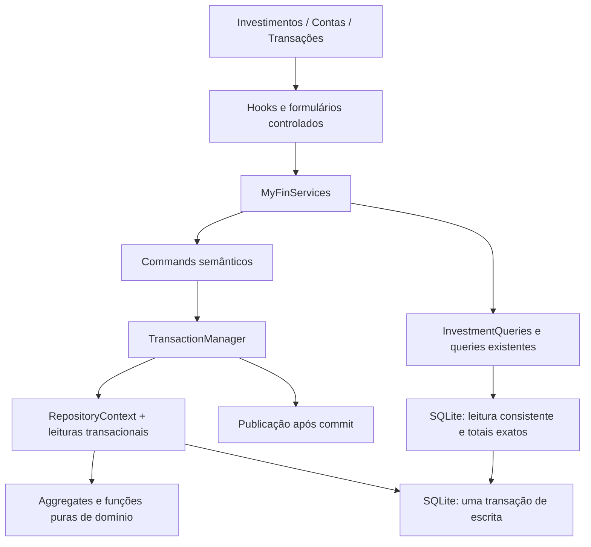
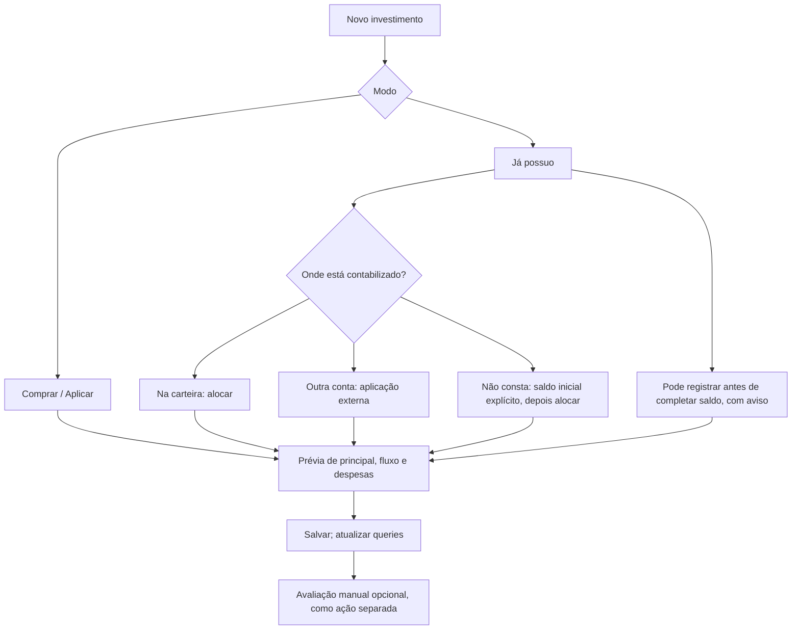

# Investimentos v1 Design

**Spec:** [spec.md](./spec.md), 148 requisitos.
**Context:** [context.md](./context.md).
**Status:** Approved. O usuário declarou: “Aprovo design, siga para tasks.md”.
**Escopo deste documento:** contratos e decisões técnicas aprovados. Decomposição em [tasks.md](./tasks.md); implementação não iniciada.

## D1 — Architecture Overview

Usaremos o ledger existente com perfis financeiros no aggregate LedgerAccount, novos aggregates de investimentos e consultas próprias. Cada operação confirma posição, operação, eventual journal e recibo idempotente na mesma transação. A UI consome MyFinServices e read models; não calcula o patrimônio a partir da página de resultados.

### Alternativas consideradas

As duas opções abaixo preservam os aggregates, fórmulas e comportamentos aprovados. A escolha técnica é como produzir os novos resumos.

| Abordagem | Benefício | Custo | Decisão |
| --- | --- | --- | --- |
| Tabelas normalizadas e resumos calculados na leitura consistente | Reutiliza ledger e ports; não introduz outro saldo persistido para reconciliar | Totais do livro percorrem seus dados, com leituras em lotes | Adotada; corresponde à base aprovada e reduz fontes concorrentes de saldo |
| Mesmas tabelas mais projeções agregadas persistidas | Resumos mais baratos para livros muito grandes | Toda mutação contábil, correção, migração e mudança de data precisa manter projeções | Não adotar na v1; considerar somente com medição que justifique a manutenção adicional |

Não reabriremos as escolhas já aceitas de conta/perfil, operação independente de journal, moeda única ou regras de correção. A aprovação das premissas fornece a base arquitetural; este documento concretiza os componentes.



Dependências de código: application depende de domain; infrastructure-sqlite e infrastructure-memory implementam ports de application; infrastructure-tauri adapta SQLite e plataforma; apps/tauri compõe os serviços. O diagrama mostra fluxo de execução, não uma dependência do domínio em infraestrutura.

`.specs/STATE.md` não existe no checkout inspecionado. Não há decisões AD-NNN nesse arquivo a reconciliar. O comando de lessons retornou zero lições confirmadas. As escolhas novas deste documento são locais à feature; não introduzem uma convenção global que exija criar STATE.md.

## D2 — Code Reuse Analysis

| Componente existente | Local | Uso no design |
| --- | --- | --- |
| LedgerAccount, lifecycle, normalização de nome, CategoryAppearance | `packages/domain/src/ledger/accounts/` | Incorporar profiles sem modificar kind, identidade ou metadados de categorias |
| Money, Currency, LocalDate, AggregateRoot, DomainFact | `packages/domain/src/shared/` | Valores, datas, erros, versões e facts; Decimal será novo |
| JournalEntry.post/createReversal/markAmendedBy | `packages/domain/src/ledger/journal/journal-entry.ts` | Equilíbrio e inversão dos postings originais; não usar os comandos genéricos dentro de operação composta |
| TransactionManager, RepositoryContext, executeUseCase | `packages/application/src/ports/` e `core/` | Uma unidade de escrita; separar erro de persistência de erro após commit |
| Clock.localDate/now e IdGenerator | `packages/application/src/ports/time.ts` | D no fuso do livro, timestamps e novos IDs internos |
| QueryPage/QuerySlice e codecs/fingerprints de cursor | `packages/application/src/querying/` | Validação, filtros, limite e cursores novos com prefixos próprios |
| SqliteTransactionManager e repositórios CAS | `packages/infrastructure-sqlite/src/` | Expandir contexto transacional e persistência por aggregate |
| InMemoryStore e InMemoryTransactionManager | `packages/infrastructure-memory/src/` | Mesmos contratos, rollback completo e cenários determinísticos |
| TauriSqliteDatabase e protocolo tipado de inteiros | `packages/infrastructure-tauri/src/database/` | Reutilizar IPC, fila e escopos de transação; não criar comandos Rust por operação de investimento |
| Actor de banco com BEGIN IMMEDIATE | `apps/tauri/src-tauri/src/database/` | Serialização nativa das escritas e foreign keys ativadas |
| MyFinServices, providers e sessão de livro | `apps/tauri/src/bootstrap/create-services.ts` e `providers/` | Wiring e isolamento de livro nos hooks |
| TransactionOverlay, Drawer e DropdownMenu | `apps/tauri/src/features/transactions/` e `packages/ui/` | Padrão de formulário, foco e ações; formulários de investimentos especializados |
| formatMinorAmount | `packages/ui/src/money/money.ts` | Exibir strings monetárias exatas na moeda recebida; não converter totais para number |

Novas superfícies públicas serão exportadas pelos `index.ts` dos packages. Como os exports apontam para `dist`, os gates de integração reconstruirão os packages em ordem de dependência antes de compilar o consumidor.

## D3 — Components e modelos de domínio

### D3.1 — Perfis de conta

Local novo: `packages/domain/src/accounts/{financial-account-profile,investment-account-profile}.ts`. São value objects de LedgerAccount; não têm ID/repository/version próprios.

```ts
interface FinancialAccountProfileSnapshot {
  type: FinancialAccountType;
  institutionName?: string;
  displayReference?: string;
  investment?: { defaultSettlementAccountId?: LedgerAccountId };
}

// Acrescentado a LedgerAccountSnapshot.
// Ausente somente em categorias, EQUITY e contas de sistema.
interface FinancialAccountFields {
  financialAccount?: FinancialAccountProfileSnapshot;
}
```

LedgerAccount recebe `configureFinancialProfile(...)`, além do lifecycle existente. Uma mudança confirmada de profile incrementa version uma vez e produz FinancialAccountConfigured ou InvestmentSettlementAccountChanged, conforme o comando. Nome/appearance continuam nos métodos existentes. `toSnapshot` e restore incluem clone profundo dos profiles.

CreateFinancialAccountCommand passa a receber `type`, instituição/referência opcionais e não recebe kind independente. Migraremos consumidores internos no mesmo conjunto de tarefas; não manteremos duas maneiras concorrentes de definir a classificação. LedgerAccount.create pode derivar profile OTHER_ASSET/OTHER_LIABILITY para chamadas contábeis internas que criam conta financeira sem profile explícito. Isso preserva factories de fixtures; o comando de produto e a UI exigem o tipo. Restore exige snapshot coerente após migração; não mascara linha financeira sem profile no banco novo.

Regra local: mapa tipo↔kind, perfil de investimento obrigatório somente em INVESTMENT_ACCOUNT e vedação a system/category. Regra de aplicação: mesmo livro, tipo/status da conta de liquidação, uso histórico de posição e dependentes ativos de settlement. A mesma política atende configure, archive e reactivate.

### D3.2 — Valores exatos

Locais novos: `shared/decimal.ts` e `investments/values/{quantity,percentage,unit-price}.ts`.

Decimal armazena coeficiente bigint e escala inteira. API mínima: `parse(string)`, `toString()`, `add`, `subtract`, `negate`, `compare`, `equals`. Somar alinha escalas por potência inteira de dez; normalizar remove zeros irrelevantes. Não há divisão, preço médio, arredondamento monetário ou dependência de biblioteca nova. Quantity/Percentage/UnitPrice aplicam suas restrições da spec sobre Decimal.

Limites de entrada, precisão 38/escala 18 e normalização são os da spec. Dinheiro da operação usa Money e passa por `assertInvestmentMoneyRange`, com limite simétrico ±9223372036854775807 para cada montante persistido. Quantidade/custo finais são validados antes de confirmar. Totais podem exceder int64 e permanecem bigint/string; somente valores que serão persistidos individualmente têm o limite da operação.

Versões e allocationRevision usam inteiros JS seguros não negativos, revisão começa em 1. Detectar overflow antes de incrementar; sequências persistidas usam string decimal de inteiro positivo, comparada numericamente. Não converter sequence para number.

### D3.3 — Instrument e Position

Locais novos: `investments/instruments/` e `investments/positions/` em domain.

```ts
interface InvestmentInstrumentSnapshot {
  id: InvestmentInstrumentId;
  bookId: BookId;
  name: string;
  normalizedName: string;
  type: InvestmentInstrumentType;
  currency: string;
  issuerName?: string;
  identifiers: readonly InstrumentIdentifierSnapshot[];
  status: "ACTIVE" | "ARCHIVED";
  version: number;
}

interface InvestmentPositionSnapshot {
  id: InvestmentPositionId;
  bookId: BookId;
  investmentAccountId: LedgerAccountId;
  instrumentId: InvestmentInstrumentId;
  label?: string;
  normalizedLabel: string;
  quantityMode: "UNITS" | "AMOUNT";
  quantity?: string;
  bookCostMinor: string;
  currency: string;
  openedOn: string;
  closedOn?: string;
  status: "OPEN" | "CLOSED";
  fixedIncomeTerms?: FixedIncomeTermsSnapshot;
  allocationRevision: number;
  allocationEffectiveOn: string;
  version: number;
}
```

Instrument tem create/restore/updateMetadata/archive/reactivate. Atualizar type é permitido somente enquanto não existir posição histórica; currency continua igual à moeda-base. Identificadores são VOs; TICKER exige mercado, ISIN o proíbe. Nomes não são únicos para instrumentos; identificadores normalizados são únicos por livro. A normalização de nomes/rótulos reutiliza normalizeSearchText.

Position tem `openWithAllocation`, `applyOperation` e `applyCorrection`, além de updateLabel/restore. A abertura é construída já com seu custo/quantidade inicial e allocationRevision=1/version=0; não persistir um aggregate vazio intermediário. Book, conta, instrumento, quantityMode e termos da contratação ficam imutáveis após abertura.

`applyOperation` avança version uma vez, inclusive para INCOME/FEE/TAX sem alteração de alocação. Essa versão também serializa a ordem de operações da posição. Revision avança somente se quantidade/custo final mudar; `applyCorrection` calcula o estado final antes de aplicar uma única mudança/version. Não chamar applyOperation duas vezes no aggregate real para simular reversal e replacement.

allocationEffectiveOn resolve o corte temporal da avaliação: na abertura/alteração econômica, é occurredOn; cancelamento com mudança econômica usa a data da reversão; amendment de operação de alocação usa a data da substituta, inclusive quando só a data mudou. INCOME/FEE/TAX sem mudança econômica conservam esse campo. Cancelar uma operação financeira sem alocação não altera a revisão nem a data de alocação.

Position aplica as transições da spec: em UNITS, q=0/custo=0 fecha, q>0/custo=0 permanece aberta e q=0/custo>0 rejeita; em AMOUNT, custo zero fecha, sem inventar quantidade. Cancelar a abertura preserva a posição zerada CLOSED e sua identidade. Não haverá ClosePosition/ReopenPosition genérico; reabertura ocorre exclusivamente na recomposição auditável.

### D3.4 — Operation, efeito contábil e Valuation

Locais novos: `investments/operations/`, `investments/valuations/` e `investments/accounting/`.

```ts
type InvestmentOperationType =
  | "OPENING_ALLOCATION" | "APPLICATION" | "PURCHASE"
  | "SALE" | "REDEMPTION" | "INCOME" | "AMORTIZATION" | "FEE" | "TAX";

interface InvestmentOperationSnapshot {
  id: InvestmentOperationId;
  bookId: BookId;
  positionId: InvestmentPositionId;
  type: InvestmentOperationType;
  role: "BUSINESS" | "REVERSAL";
  occurredOn: string;
  settledOn?: string;
  recordedAt: string;
  sequence: string;
  description: string;
  currency: string;
  quantityDelta?: string;
  bookCostDeltaMinor: string;
  grossAmountMinor: string;
  feesMinor: string;
  taxesMinor: string;
  netCashFlowMinor: string;
  cashMode: "NONE" | "INTERNAL_CASH" | "EXTERNAL_ACCOUNT";
  settlementAccountId?: LedgerAccountId;
  categories: InvestmentCategoryRefs;
  positionBefore: PositionEconomicState;
  journalEntryId?: JournalEntryId;
  reversalOf?: InvestmentOperationId;
  reversedBy?: InvestmentOperationId;
  replacementOf?: InvestmentOperationId;
  replacedBy?: InvestmentOperationId;
  version: number;
}

interface InvestmentValuationSnapshot {
  id: InvestmentValuationId;
  bookId: BookId;
  positionId: InvestmentPositionId;
  allocationRevision: number;
  valuedAt: string;
  valuedOn: string; // LocalDate de valuedAt no fuso do livro.
  recordedAt: string;
  recordSequence: string;
  source: "MANUAL";
  quantity?: string;
  unitPrice?: string;
  currency: string;
  grossValueMinor: string;
  netValueMinor?: string;
  withdrawableValueMinor?: string;
}
```

Os tipos referenciados nos exemplos são contratos novos, não APIs existentes. InvestmentCategoryRefs guarda IDs opcionais de gain/loss/income/fee/tax. PositionEconomicState guarda quantidade opcional, custo, status, openedOn, closedOn opcional e allocationEffectiveOn anteriores; não guarda version/revision para restaurá-las. Para abertura, estado anterior é ausência de posição, representada por variante explícita `UNOPENED`, não por conta/posição fictícia.

`isEffective()` da operação exige role=BUSINESS e ausência de reversedBy/replacedBy. Operações antigas têm apenas seus links e version alterados. Efeitos e datas originais são imutáveis. Reversões preservam os montantes descritivos e invertem quantityDelta, bookCostDelta e netCashFlow; não passam pela validação de sinais de uma compra/venda nova. journalEntryId aponta para o journal da própria reversão, se houver.

`InvestmentAccountingPlan` é uma função pura de valores/contas já validados. Produz deltas da operação e lista de postings da matriz da spec. Agrupa por accountId, remove zeros e chama JournalEntry.post somente quando restarem postings. Não duplica fees/taxes em operações auxiliares. Ordens de postings são determinísticas: carteira, conta externa, ganho/perda/renda, taxas, impostos, com agrupamento por primeira ocorrência.

Para desfazer, usar quantityDelta/bookCostDelta/netCashFlow persistidos e JournalEntry.createReversal do original; não executar InvestmentAccountingPlan com entradas reconstruídas. A substituta, por ser fato novo, usa o plano atual validado sobre o estado anterior à operação alvo.

Valuation é registro imutável, fora do array da Position. `valuedOn` é calculado pela aplicação com o fuso do livro, nunca recebido como autoridade do caller. Não há source de fornecedor, import command ou InstrumentQuote nesta entrega. Atualizar avaliação é append; igualdade de timestamp não impede novo registro.

## D4 — Contracts da aplicação

Locais novos: `packages/application/src/investments/{accounts,instruments,positions,operations,valuations,queries}/` e `ports/investment-*.ts`.

### D4.1 — Envelopes e drafts

```ts
interface InvestmentRequest {
  bookId: string;
  requestId: string; // UUID criado uma vez pelo cliente para esta intenção.
}

interface InvestmentWarning {
  code: "INVESTMENT_CASH_NEGATIVE";
  investmentAccountId: string;
  cashMinor: string;
  currency: string;
  asOf: string;
}

interface InvestmentMutationResult {
  requestId: string;
  positionId?: string;
  positionVersion?: number;
  allocationRevision?: number;
  operationId?: string;
  reversalOperationId?: string;
  replacementOperationId?: string;
  valuationId?: string;
  journalEntryIds: readonly string[];
  warnings: readonly InvestmentWarning[];
}

type CashRoute =
  | { mode: "INTERNAL_CASH" }
  | { mode: "EXTERNAL_ACCOUNT"; accountId: string };

interface OperationDateInput {
  occurredOn: string;
  settledOn?: string;
  description: string;
  currency: string;
}
```

Os drafts são discriminados por tipo. Compra/aplicação: quantity opcional conforme modo da posição, capitalMinor>0, feesMinor/taxesMinor com default zero, funding:CashRoute e categorias de despesas. Venda/resgate: quantity conforme modo, bookCostReductionMinor explícito, grossProceedsMinor≥0, fees/taxes, destination:CashRoute e categorias necessárias. INCOME: grossAmountMinor>0, fees/taxes e categorias; somente caixa interno. AMORTIZATION: custo reduzido>0, recebimento bruto, fees/taxes e categorias; não recebe quantityDelta. FEE/TAX: amountMinor>0, expenseCategoryId; somente caixa interno.

Valores monetários/quantidades são strings; campos numéricos de versão são inteiros seguros. Comandos recebem bruto e principal, não netCashFlow nem postings arbitrários. Campos opcionais omitidos têm defaults canônicos antes do fingerprint. Input contraditório, como accountId em modo interno, é rejeitado em vez de ignorado.

### D4.2 — Comandos públicos

| Comando | Entrada adicional ao envelope | Resultado / observação |
| --- | --- | --- |
| CreateFinancialAccount | name, type, institutionName?, displayReference? | AccountDto com profile; aproveitar caso de uso existente |
| ConfigureFinancialAccount | accountId, expectedVersion, profile | AccountDto; kind não muda |
| Set/ClearInvestmentSettlementAccount | accountId, expectedVersion, settlementAccountId quando set | Alteração única no LedgerAccount |
| Create/UpdateInvestmentInstrument | campos de instrumento; ID/expectedVersion em update | InstrumentDto; type só mutável antes de uso |
| Archive/ReactivateInvestmentInstrument | instrumentId, expectedVersion | InstrumentDto com lifecycle |
| OpenInvestmentPosition | conta, instrumento, label?, quantityMode, terms?, opening discriminado | MutationResult; opening é OPENING_ALLOCATION ou PURCHASE/APPLICATION completo |
| UpdateInvestmentPositionMetadata | positionId, expectedVersion, label? | PositionDto; não altera alocação |
| RecordInvestmentPurchase/Application/Sale/Redemption/Income/Amortization/Fee/Tax | positionId, expectedPositionVersion, draft do tipo | MutationResult |
| ReverseInvestmentOperation | operationId, expectedOperationVersion, expectedPositionVersion, reason | MutationResult; datas são derivadas do original |
| AmendInvestmentOperation | mesmos IDs/versões, reason, replacement do mesmo tipo | MutationResult; conta/posição/instrumento não mudam |
| RecordInvestmentValuation | positionId, expectedAllocationRevision, valuedAt, valores opcionais e bruto | MutationResult; sem alterar Position.version |
| GetInvestmentRequestResult | bookId, requestId | Recibo confirmado ou ausência; recuperação de resposta perdida |

Envelope idempotente é obrigatório em abertura, operação, correção e avaliação. Catálogos/configurações usam IDs/versões e Result como os existentes; não estender idempotência a todos os cadastros nesta feature. A coluna de envelope da tabela indica bookId sempre e requestId nos comandos idempotentes.

Saldo inicial explícito do fluxo de investimentos usa `SetInvestmentOpeningBalance`, um wrapper idempotente com requestId e valores de SetOpeningBalance. Extrair o trabalho transacional do caso de uso existente para função compartilhada; ambos reutilizam a mesma regra OPENING_BALANCE_ALREADY_SET e JournalEntryFactory.setOpeningBalance. Não invocar um execute que abra outra transação. É um passo independente da abertura/alocação, conforme INV-137.

### D4.3 — Ports e contexto transacional

```ts
type BookScopedLookup<T> =
  | { kind: "FOUND"; value: T }
  | { kind: "NOT_FOUND" }
  | { kind: "BOOK_MISMATCH" };

interface InvestmentInstrumentRepository {
  findById(bookId: BookId, id: InvestmentInstrumentId): Promise<BookScopedLookup<InvestmentInstrument>>;
  existsWithIdentifier(bookId: BookId, identifier: InstrumentIdentifierSnapshot,
    excludeId?: InvestmentInstrumentId): Promise<boolean>;
  add(value: InvestmentInstrument): Promise<void>;
  save(value: InvestmentInstrument, expectedVersion: number): Promise<void>;
}

interface InvestmentPositionRepository {
  findById(bookId: BookId, id: InvestmentPositionId): Promise<BookScopedLookup<InvestmentPosition>>;
  hasAnyForAccount(bookId: BookId, id: LedgerAccountId): Promise<boolean>;
  hasAnyForInstrument(bookId: BookId, id: InvestmentInstrumentId): Promise<boolean>;
  hasOpenForAccount(bookId: BookId, id: LedgerAccountId): Promise<boolean>;
  hasOpenForInstrument(bookId: BookId, id: InvestmentInstrumentId): Promise<boolean>;
  add(value: InvestmentPosition): Promise<void>;
  save(value: InvestmentPosition, expectedVersion: number): Promise<void>;
}

interface InvestmentOperationRepository {
  findById(bookId: BookId, id: InvestmentOperationId): Promise<BookScopedLookup<InvestmentOperation>>;
  findLastEffective(bookId: BookId, positionId: InvestmentPositionId,
    excludeOperationId?: InvestmentOperationId): Promise<InvestmentOperation | null>;
  findOwnerOfJournal(bookId: BookId, id: JournalEntryId): Promise<InvestmentOperation | null>;
  add(value: InvestmentOperation): Promise<void>;
  saveLineage(value: InvestmentOperation, expectedVersion: number): Promise<void>;
}

interface InvestmentValuationStore {
  append(value: InvestmentValuationSnapshot): Promise<void>;
}

interface InvestmentRequestStore {
  find(bookId: BookId, requestId: string): Promise<InvestmentRequestReceipt | null>;
  add(receipt: InvestmentRequestReceipt): Promise<void>;
}

interface InvestmentTransactionReads {
  hasActiveSettlementDependents(bookId: BookId, accountId: LedgerAccountId): Promise<boolean>;
  accountLedgerBalance(bookId: BookId, accountId: LedgerAccountId,
    asOf?: LocalDate): Promise<string>;
  accountCash(bookId: BookId, accountIds: readonly LedgerAccountId[],
    asOf: LocalDate): Promise<readonly InvestmentCashState[]>;
}

interface InvestmentSequenceStore {
  next(bookId: BookId): Promise<string>;
}
```

RepositoryContext acrescenta instruments, investmentPositions, investmentOperations, investmentValuations, investmentRequests, investmentSequences e investmentReads. Os nomes finais seguem essa lista; os tipos acima correspondem a cada propriedade. accountCash retorna ledgerMinor, positionCostMinor, cashMinor e moeda por carteira, calculados após as gravações no executor da transação.

LedgerAccountRepository continua sendo o dono dos profiles. Não criar FinancialAccountRepository ou FixedIncomeTermsRepository. Repositórios novos recebem bookId no lookup para isolamento. O adapter verifica internamente existência e livro do ID, mas só reconstrói/devolve o aggregate no ramo FOUND do livro solicitado. A aplicação traduz BOOK_MISMATCH e NOT_FOUND nos erros BOOK_MISMATCH e ENTITY_NOT_FOUND; nenhum ramo devolve dados do outro livro. findLastEffective ordena por occurredOn/sequence e aceita excluir o alvo ao validar a data de uma substituição.

## D5 — Fluxos, idempotência e concorrência

### D5.1 — Registrar operação

```mermaid
sequenceDiagram
    participant U as UI
    participant C as Command
    participant T as TransactionManager
    participant D as Domain
    participant R as Repositories
    U->>C: draft + requestId + versões
    C->>T: execute(work)
    T->>R: buscar recibo no livro
    alt request já confirmado
      R-->>T: resultado imutável
    else request novo
      T->>R: carregar posição, instrumento, contas e categorias
      T->>D: validar e construir efeitos
      D-->>T: estado final + operação + postings
      T->>R: salvar com CAS; calcular avisos; salvar recibo
    end
    T-->>C: commit + resultado + facts
    C->>C: publicar facts após commit
    C-->>U: Result.ok(resultado salvo)
```

Normalizar sintaxe antes da transação, mas validar existência/status/moeda/versão dentro dela. Ler hoje e timestamp uma vez por tentativa nova. Recibo existente é consultado antes de CAS, data relativa a hoje ou validação de status, para que retry não falhe porque o estado mudou depois do sucesso original.

Fingerprint: armazenar representação JSON canônica do comando, com commandType, bookId, requestId, campos normalizados, versões e versão de formato `1`. Chaves ordenadas e arrays semanticamente ordenados quando forem conjuntos; preservar ordem quando ela tiver significado. Excluir IDs/timestamps gerados no servidor. Comparação de texto exato evita depender de hash criptográfico/SDK ou de colisões. Recibo armazena canonicalCommand, resultJson, formatVersion e recordedAt. Dados ficam no mesmo vault, sem cópia em logs.

Chave única `(book_id, request_id)`. A transação nativa de escrita já começa em BEGIN IMMEDIATE; outra tentativa aguarda ou recebe busy sem alteração parcial. Não precisa de recibo PENDING persistido: resultado e alterações confirmam juntos. Se a confirmação se perder no IPC, retornar erro de resultado indeterminado, preservar requestId e consultar/repetir; nunca garantir rollback quando não se sabe se COMMIT foi aplicado. A consulta de recibo e o retry resolvem a incerteza.

Os fatos de um retry confirmado não são publicados novamente. Avisos financeiros do recibo são o resultado daquela gravação; a UI busca as queries atuais após sucesso/replay para exibir o diagnóstico vigente. Editar um draft cria novo requestId; retry do mesmo draft conserva o anterior. UI mantém o ID enquanto não houver confirmação e não transforma timeout em nova intenção.

### D5.2 — Correção coordenada

Ler alvo e posição no mesmo executor; comparar versões e exigir alvo=última operação efetiva. Sequência ordena operações do mesmo dia. Uma reversão não é candidata; um alvo já substituído/cancelado falha. Validar o replacement contra a operação efetiva anterior excluindo o alvo; a data fica entre essa data e hoje.

Calcular estado anterior pelos deltas e positionBefore; validar que o estado atual corresponde à aplicação do alvo sobre esse estado. Não restaurar versões/revisão antigas. Cancelamento aplica o estado econômico anterior com o tratamento UNOPENED→CLOSED zerado; amendment aplica a substituição sobre ele. A alteração final do aggregate ocorre uma vez. Reabertura exige conta/instrumento ativos. Reversão histórica de categorias arquivadas usa os postings originais; a substituição nova exige categorias ativas.

| Journal do original | Journal da substituta | Ação |
| --- | --- | --- |
| Ausente | Ausente | Apenas lineage de operações e posição |
| Ausente | Presente | Criar journal novo, sem replacementOf contábil fictício |
| Presente | Ausente | Criar reversão do original; original marcado reverted, sem journal vazio de substituição |
| Presente | Presente | Reverter original, criar replacement com replacementOf=original.id e marcar original amended |

Todas as situações criam OperationReversal e, em amendment, Operation replacement. Cancelamento só usa as colunas do original e sua reversão. Montantes descritivos não precisam ter o mesmo sinal que os deltas de reversão. Persistir novos journals antes de operações que os referenciam; inserir novas operações de lineage antes de atualizar o original para apontar para elas. Rollback cobre qualquer falha intermediária.

Quando a cadeia contábil foi interrompida por uma substituta sem journal e uma correção posterior volta a criar um journal, o vínculo de operações continua completo. Não religar artificialmente o journal novo à cadeia contábil antiga. A UI segue a cadeia de operações para a história financeira completa.

### D5.3 — Valuation concorrente e ordenação

RecordInvestmentValuation recebe expectedAllocationRevision; compara dentro da transação imediatamente antes do append. Não atualiza Position.version. O bloqueio de escrita impede que uma operação mude a posição entre a comparação e o append. Se a avaliação vence a corrida, a operação seguinte avança a revisão e torna a avaliação histórica; se a operação vence, a avaliação obsoleta é rejeitada. Ambas as ordens preservam os fatos.

Validar valuedAt ISO com offset explícito, normalizar UTC e calcular valuedOn no fuso do livro. recordedAt vem de Clock.now, recordSequence do contador transacional. Seleção vigente: mesma allocationRevision, valuedOn≥allocationEffectiveOn, maior valuedAt, depois recordedAt, depois recordSequence. Empate total de relógio é resolvido pela sequência, não pelo ID aleatório. Avaliação de CLOSED pode constar do histórico, mas nunca altera valor consolidado zero.

### D5.4 — Publicação e avisos

Extrair no executor comum as etapas “persistir” e “publicar após commit”. Acrescentar opção `postCommitFailureMode: "fail" | "preserveCommitted"`, mantendo default atual para consumidores não migrados. Comandos de investimento e wrappers financeiros desta feature usam preserveCommitted: falha de dispatch é registrada por um DiagnosticReporter sem payload financeiro e não converte resultado confirmado em Result.fail. O reporter é best effort; sua própria falha também não altera o resultado confirmado. Não adicionar outbox ou promessa de entrega exatamente uma vez; nenhum handler pode ser responsável por completar a operação financeira.

TauriEventPublisher já captura erros de listeners. O executor ainda precisa cobrir erro do dispatcher/tipo desconhecido ou de outro publisher. Registrar todos os tipos novos em ApplicationEventType e no dispatcher. Hooks invalidam queries pelo resultado do comando, portanto atualização da UI não depende de um evento ter chegado.

RecordIncome/Expense, TransferMoney, SetOpeningBalance e correções genéricas acrescentam `warnings?: readonly InvestmentWarning[]` ao DTO existente de forma aditiva. Calcular os avisos de carteiras afetadas dentro da mesma transação após os postings. Caixa negativo nunca provoca rollback. A consulta não usa uma nova transação nem a fila pública Tauri enquanto estiver dentro do escopo de escrita.

## D6 — Data Models e persistência SQLite

Tabelas novas são STRICT; montantes monetários individuais usam INTEGER e parâmetros string previamente validados, lidos como string. Quantidade, taxa e preço usam TEXT canônico, nunca REAL. Timestamps UTC têm formato fixo `YYYY-MM-DDTHH:mm:ss.SSSZ` para comparação; LocalDate usa YYYY-MM-DD. Campos opcionais usam NULL no banco e ausência em DTO.

| Tabela | Chave e principais colunas | Constraints/índices |
| --- | --- | --- |
| financial_accounts | ledger_account_id PK, book_id, type, institution_name, display_reference | UNIQUE(account_id,book_id); FK composta para ledger_accounts |
| investment_accounts | ledger_account_id PK, book_id, default_settlement_account_id? | FK para financial_accounts; settlement FK composta; check não referenciar a própria carteira |
| investment_instruments | id PK, book_id, name, normalized_name, type, currency, issuer_name?, status, version | UNIQUE(id,book_id); índices book/status/type/name/id |
| investment_instrument_identifiers | instrument_id, book_id, scheme, value, normalized_value, market normalizado não nulo | PK da tupla do instrumento; UNIQUE(book,scheme,normalized_value,market); FK composta; market='' para ISIN |
| investment_positions | id PK, book_id, investment_account_id, instrument_id, label?, normalized_label, quantity_mode, quantity?, book_cost_minor, currency, opened_on, closed_on?, status, allocation_revision, allocation_effective_on, version | UNIQUE(id,book); FKs compostas para carteira/instrumento; índices book/account/status e book/instrument/status; nenhuma unicidade conta+instrumento |
| investment_fixed_income_terms | position_id PK, book_id, rate_kind?, index?, annual_rate?, index_percentage?, annual_spread_rate?, issue_date?, maturity_date?, grace_period_date? | FK composta para posição; checks das variantes de taxa e pares de datas conhecidos |
| investment_sequences | book_id PK, last_sequence INTEGER | FK livro; contador positivo monotônico, limitado a int64; reservado na transação |
| investment_operations | colunas escalares do snapshot Operation, role, deltas, contas/categorias, state-before discriminado, lineage, version | UNIQUE(id,book); UNIQUE(book,sequence); FK composta para posição, journals, contas/categorias e lineage |
| investment_valuations | colunas do snapshot Valuation, record_sequence INTEGER | UNIQUE(id,book); UNIQUE(book,record_sequence); FK composta para posição; índice de seleção vigente |
| investment_request_receipts | book_id, request_id, format_version, canonical_command, result_json, recorded_at | PK(book,request); FK livro; sem expiração pública |

Nomes `account_id` abreviados na tabela de constraints referem-se a ledger_account_id. No SQL final, nomes de coluna são consistentes com o cabeçalho de cada tabela. As snapshots de `positionBefore` ocupam colunas explícitas: before_kind (UNOPENED/EXISTING), before_quantity?, before_book_cost_minor?, before_status?, before_opened_on?, before_closed_on?, before_allocation_effective_on?. Não usar JSON para fatos relacionais; JSON é reservado ao recibo de comando/resultado versionado.

Índice vigente de valuation: `(book_id, position_id, allocation_revision, valued_at DESC, recorded_at DESC, record_sequence DESC)`. O predicado valued_on é aplicado antes de LIMIT 1. Histórico usa `(book_id,position_id,valued_at DESC,record_sequence DESC)`. Operações usam `(book_id,position_id,occurred_on DESC,sequence DESC)`, índice parcial de operações efetivas e UNIQUE parcial de `(book_id,journal_entry_id)` quando não nulo.

As operações incluem UNIQUE `(id,book_id,position_id)`. As FKs de lineage usam essa tripla para proibir ligação a outra posição, além dos checks contra autorreferência e exclusividade dos links. Um registro role=REVERSAL exige reversal_of e não pode ter reversed_by/replaced_by. Original pode adquirir links por CAS uma vez. JournalEntry conserva suas constraints atuais; não adicionar campos de fornecedor ou novos tipos contábeis.

Profiles: triggers locais validam que o ledger pai é financeiro não-system, que type corresponde a kind e que investment_accounts pertence a type INVESTMENT_ACCOUNT. Verificação de atividade, saldo e existência de posições é política transacional da aplicação; não fazer triggers que somem patrimônio ou repliquem toda a matriz contábil. Operações/avaliações guardam bookId nas FKs mesmo que o ID global pareça suficiente.

Valuations têm triggers que rejeitam UPDATE/DELETE. Operações têm proteção de UPDATE dos campos de efeito/datas e permitem apenas evolução dos links/version; DELETE não é API pública. Position permite somente campos mutáveis por CAS; o repository não atualiza book/account/instrument/quantityMode/terms. Strings decimais passam pelo parser antes de gravar e também no restore. Não executar aritmética de Decimal por CAST REAL no SQL.

Repository add exige version=0; save exige expectedVersion+1 e verifica rowsAffected=1 antes de escrever as tabelas filhas. Mutation de metadata sem mudança real conserva versão e não chama save. Repositórios usam o executor recebido; operações de múltiplas tabelas só são expostas via transação. Get/find read-only que reconstruam filhos usam reader consistente, evitando combinar profile de uma versão com o pai de outra.

### D6.1 — Migrações

A versão atual inspecionada termina em 0004. Sequência planejada: 0005 profiles/backfill; 0006 instrumentos/identificadores; 0007 posições/termos; 0008 operações/sequência; 0009 avaliações; 0010 recibos. Se outra feature ocupar números antes da execução, renumerar somente os arquivos novos ainda não aplicados; não alterar checksums anteriores.

Backfill copia ASSET não-system→OTHER_ASSET e LIABILITY não-system→OTHER_LIABILITY, inclusive contas arquivadas. Não modifica postings, versões de contas, nomes, categorias ou accounts de sistema; não emite fatos de criação para dados migrados. Profiles de investimento só aparecem por classificação explícita posterior.

Cada migration confirma separadamente, como o runner atual. Falha deixa as migrations anteriores registradas e reverte apenas a atual. O bootstrap só expõe a aplicação após completar todas. Executar `generate:migrations` e verificar `check:migrations`; source SQL e manifesto gerado são parte da mesma mudança futura. Testar banco vazio, fixture na versão 4, reexecução e falha de uma migration intermediária.

### D6.2 — Memória e plataforma

InMemoryStoreSnapshot inclui instrumentos, posições, operações, avaliações, recibos e contador. Clone profundo de profiles/identificadores/termos/state-before evita que uma referência mutable escape do rollback. InMemoryTransactionManager instancia todos os novos ports dentro da fila existente; restore desfaz dados e sequências após erro.

Criar doubles de repositories/reads para testes de application e adapter memory coerente para testes transacionais. Não transformar testes de SQLite em testes que usam memória escondida. A prova relacional/SQL continua em better-sqlite3 e a prova nativa passa pelo IPC Tauri.

IdGenerator ganha nextInvestmentInstrumentId/PositionId/OperationId/ValuationId; atualizar adaptadores Tauri e sequenciais de teste. requestId é UUID do cliente; não derivar de ID externo ou timestamp. O protocolo nativo já preserva int64 como strings; não é necessário trocar o driver nem habilitar plugin SQL diferente.

## D7 — Read models, valores exatos e cursores

Locais novos: `application/investments/queries/`, `ports/investment-queries.ts` e `infrastructure-sqlite/src/queries/investments/`.

```ts
interface InvestmentPortfolioSummary {
  bookId: string;
  currency: string;
  asOf: string;
  availableMinor: string;
  otherAssetsMinor: string;
  archivedDailyAccountBalanceMinor: string;
  bookNetWorthMinor: string;
  marketNetWorthMinor: string;
  investmentLedgerMinor: string;
  positionCostMinor: string;
  investmentCashMinor: string;
  investmentMarketValueMinor: string;
  unrealizedResultMinor: string;
  openPositionCount: number;
  valuedPositionCount: number;
  valuationDateRange: { oldest: string; newest: string } | null;
  warnings: readonly InvestmentWarning[];
}

interface PositionValuationView {
  basis: "VALUATION" | "BOOK_COST" | "CLOSED";
  currentValueMinor: string;
  valuationId?: string;
  valuedAt?: string;
  netValueMinor?: string;
  withdrawableValueMinor?: string;
}
```

Query API: GetInvestmentPortfolioSummary, ListInvestmentAccounts, GetInvestmentAccountDetail, ListInvestmentInstruments, ListInvestmentPositions, GetInvestmentPositionDetail, ListInvestmentOperations e ListInvestmentValuations. ListAccounts retorna carteiras, saldos e contagens; detail retorna apenas metadata/resumo, não histórico infinito. Instrument list alimenta seletores e manutenção. Position detail não carrega histórico; os dois históricos têm cursores independentes.

`GetInvestmentPortfolioSummary` resolve livro/moeda/fuso, lê Clock.localDate uma vez e delega com D explícito. Adapter usa um único readTransaction para contas/postings/posições/avaliações. Disponível usa somente contas ativas BANK/PAYMENT/CASH; patrimônio inclui ativos/passivos arquivados e system como GetNetWorth. Outros ativos inclui OTHER_ASSET; saldo arquivado de conta diária tem campo próprio. Carteira zero e livro vazio usam moeda do livro, nunca fallback BRL.

### D7.1 — Agregação exata

SQLite SUM de inteiros pode exceder int64 antes mesmo de um CAST AS TEXT; TOTAL usa ponto flutuante. Por isso criar `SqliteExactLedgerTotals`, helper de infraestrutura que recebe SqliteReader e filtros parametrizados, percorre postings em lotes de até 512 e soma por bigint no TypeScript. O cursor interno usa chave estável do posting dentro da leitura consistente; não depende de OFFSET, string lexicográfica de sequência ou aggregate carregado em memória.

Aplicar o helper aos novos resumos/avisos e às agregações monetárias existentes atingidas pelos investimentos: saldos/extrato, NetWorth, monthly cash flow, category spending e journal summary. Preservar filtros, sinal, período e contratos de resultado dos métodos existentes. O helper recebe o reader atual, nunca abre outra transação durante uma transação; isso evita deadlock na fila do adapter Tauri.

Não buscar o histórico inteiro para somar no browser. O scan ocorre no read adapter e mantém apenas acumuladores por grupo, com páginas limitadas no IPC. Query de posições/avaliações usa joins e subquery indexada para última avaliação de cada posição; não chamar repository.findById por linha. A leitura inteira do livro custa O(postings+posições), embora a memória e cada resposta IPC sejam limitadas. Cache/projeção persistida exige medição futura; esse custo está listado nos riscos.

### D7.2 — Filtros e ordenação

ListPositions: filtros bookId, accountId?, assetClass?, status (padrão OPEN) e search normalizado por nome do instrumento/rótulo. Ordem `(instrument.normalized_name, position.normalized_label, position.id)`. Campo search de instrumento é normalizado no write; rótulo é normalizado na posição. LIKE usa parâmetros e escape de `%`, `_` e caractere de escape quando a busca é literal. Não converter filtros de usuário em SQL interpolado.

Limite padrão 25, máximo 100. Buscar limit+1, cortar a página e derivar cursor pelo último item retornado. Cursores têm prefixos/versionamento próprios `ip1`, `io1`, `iv1`, payload codificado de forma reversível e fingerprint dos filtros canônicos incluindo bookId e posição da consulta. Decodificação valida estrutura, comprimentos, IDs, datas e sequência. Não aceitar cursor de outro livro ou filtro; resposta INVALID_QUERY com campo cursor.

Histórico de operações: occurredOn desc, sequence desc, id. Histórico de avaliações: valuedAt desc, recordSequence desc, id. Sequências são INTEGER no banco e string no DTO; ordenar no SQL pelo inteiro original. Filtros de lista não alteram resumo do livro. Mutações invalidam as listas e reiniciam os cursores carregados; não prometer snapshot entre páginas separadas por alterações.

Valor vigente usa bruto da revisão atual; ausência conserva custo e basis=BOOK_COST. Posição CLOSED sempre tem basis=CLOSED e valor zero, mesmo se existirem avaliações. Coverage conta somente posições OPEN e efetivamente avaliadas; datas refletem somente as avaliações usadas no total. Campos líquidos/resgatáveis ausentes continuam ausentes. Em carteira inconsistente, totais mantêm a fórmula e warnings de todas as carteiras com caixa negativo, mesmo que o caixa agregado entre carteiras seja positivo.

## D8 — Integração com Transações e Contas

JournalBusinessType acrescenta INVESTMENT para leitura e filtro, sem acrescentá-lo a JournalBusinessDraft genérico de edição. JournalChainListItem/Detail recebem `investment?: { operationId, positionId, operationType, netCashFlowMinor, grossAmountMinor, bookCostDeltaMinor }` e `canEditWithGenericFlow: boolean`. O vínculo é obtido por investment_operations.journal_entry_id; origem continua MANUAL ou SYSTEM, não INVESTMENT/PLUGGY.

Classificação de leitura prioriza vínculo de investimento antes da heurística de INCOME/EXPENSE. `amountMinor` de uma linha INVESTMENT é o valor absoluto de netCashFlow da operação correspondente; pode ser zero, e a UI usa também principal/resultado/despesas do detalhe. Uma operação sem journal não ganha linha artificial em Transações. Ações genéricas desaparecem para vínculos e o backend bloqueia chamadas diretas com INVESTMENT_OPERATION_REQUIRED.

GetJournalChainSummary separa seleção de cadeias da soma de postings. Para os filtros selecionados, receitas/despesas vêm de todos os postings correspondentes por kind, respeitando o lifecycle/intervalo da query, e nunca da classificação única da linha. Para cadeia cancelada, contribuições financeiras líquidas são zero no resumo de cadeias; os filtros/count de cadeias mantêm o comportamento existente. MonthlyCashFlow mantém a semântica por data dos postings, incluindo reversões. Não confundir esse resumo temporal com contagem de cadeias.

`largestTransactionMinor` usa o máximo absoluto do amountMinor das cadeias financeiras efetivas selecionadas, incluindo INVESTMENT; `transactionCount` continua contagem de cadeias, sem contar cada posting. Corrigir original com journal para substituta sem journal deixa a antiga cadeia contábil cancelada; o detalhe mostra o vínculo com a operação atual para acessar sua história.

Alterar types=ALL no modelo de filtros, labels, codecs de query, mocks e renderizadores para conhecer INVESTMENT. Busca/paginação continuam no servidor; deferir apenas o texto de busca no React. Guards de Amendment/Reverse verificam ownership do journal dentro da transação antes de qualquer mudança; isso inclui journals de reversão e substituição.

Contas recebe seleção de tipo financeiro e instituição/referência opcionais, ação de reclassificar e configuração de settlement. Se houver posições históricas, retirar INVESTMENT_ACCOUNT é bloqueado. Profile não duplica saldo nem exclui a conta dos relatórios existentes. O card “Saldo consolidado” passa a “Patrimônio contábil”; o novo disponível e patrimônio avaliado vêm da query de investimentos. Alterar o tipo de uma conta invalida ambos os conjuntos de queries.

## D9 — UI e composição Tauri

Locais novos: `apps/tauri/src/features/investments/{components,hooks,forms}/`. MyFinServices ganha `investments` com subgrupos accounts, instruments, positions, operations, valuations, portfolio e requests. A composição cria os novos queries/repositories/executores; UI usa useMyFin/useActiveBook existentes. Atualizar testes da superfície pública de create-services e todos os fakes tipados.

Rotas: `/investments` e `/investments/positions/:positionId` sob ApplicationShell. Detalhe valida livro ativo, não infere livro do ID. Sem livro, usar o fluxo existente. Sidebar/breadcrumb reconhecem Investimentos. Não alterar a rota de dashboard nesta feature.

Página: resumo patrimonial, lista de carteiras e lista paginada de posições, com ação “Novo investimento”. Carteiras exibem L/C/caixa/valor avaliado/resultado; posições mostram classe/quantidade/custo/base de avaliação/status. A página mantém resumo independente dos filtros. History aparece no detalhe, com tabs Operações/Avaliações, ambas paginadas.



Forms usam RHF/Zod e componentes controlados locais. Drawer para abertura/operação/avaliação/correção; DropdownMenu para ações compactas. Instrument editor e account editor reutilizam catálogos/forms onde o contrato permitir; cadastro novo não é feito como efeito oculto de operação. Se catálogo confirmar e operação falhar, o cadastro permanece para reutilização; o erro preserva o draft. A unidade financeira começa somente quando carteira/instrumento existentes forem selecionados. Durante submissão, desabilitar novo envio do mesmo formulário e manter indicador de progresso; isso complementa a idempotência do backend.

Prévia é calculada por caso de uso read-only que chama o mesmo planner puro e lê o estado atual, sem reservar sequência, gerar IDs financeiros ou persistir recibo. Retorna deltas, categorias, caixa projetado, warnings e versões utilizadas. Confirmar repete todas as validações na transação; a prévia não autoriza usar versão obsoleta. Caixa negativo deixa Salvar habilitado e não abre confirmação adicional. A UI mostra aviso também nos totais após salvar, não apenas no toast.

Key factory: `['investments', bookId, resource, filtros]`; portfolio inclui data de referência vigente. No focus/refetch e na mudança do dia do livro, recalcular D; timer revalida a data, sem assumir que um dia local tem sempre 24 horas. Queries antigas não escrevem na chave do livro novo. Troca de livro fecha drawers, limpa seleção/cursor e ignora atualização visual de mutation do livro anterior; a operação já enviada pode confirmar no livro original e seus IDs/keys permanecem associados a ele.

Sucesso invalida, no livro da mutation: portfolio, carteiras, posições, detalhe, operações, avaliações e queries de contas/transações/insights afetadas. Erro preserva campos/requestId; conflito de versão pede recarregar, mantendo dados digitados para reaplicação consciente. Não há retry automático ilimitado para erro de domínio. Erro de resultado indeterminado usa consulta de recibo e retry idempotente.

Loading não vira zero. Erro de consulta apresenta refetch; stale data visível é identificada como dado anterior. Estado vazio usa moeda do livro e ação de cadastro. Foco inicial, escape, retorno ao acionador, labels, leitura do aviso e teclado seguem o padrão do Drawer. Em 360px, cards empilham e a tabela pode rolar internamente; nenhum formulário ou botão fica fora do viewport.

## D10 — Error Handling Strategy

| Situação | Tratamento | Efeito observável |
| --- | --- | --- |
| Caixa negativo | Success + INVESTMENT_CASH_NEGATIVE por carteira | Registro salvo; aviso persistente derivado das queries |
| Custo desconhecido | INVESTMENT_BOOK_COST_REQUIRED | Solicitar custo; não inferir valor de mercado |
| Quantidade/custo/data/moeda inválidos | Códigos INV da spec | Erro de campo; nenhuma gravação |
| Livro divergente / entidade ausente | BOOK_MISMATCH / ENTITY_NOT_FOUND | Não revelar dados do livro diferente |
| CAS de posição/operação/profile | OPTIMISTIC_CONCURRENCY_FAILURE | Recarregar o estado; não sobrescrever silenciosamente |
| Avaliação de revisão antiga | INVESTMENT_ALLOCATION_CHANGED | Atualizar a posição antes de informar seu valor |
| requestId com conteúdo diferente | IDEMPOTENCY_CONFLICT | Não repetir nem sobrescrever o recibo |
| Journal de investimento em comando genérico | INVESTMENT_OPERATION_REQUIRED | Abrir a operação especializada |
| Correção fora da última operação efetiva | INVESTMENT_OPERATION_NOT_CORRECTABLE | Mostrar qual operação posterior precisa ser tratada |
| Saldo inicial já ativo | OPENING_BALANCE_ALREADY_SET | Navegar para correção explícita do existente |
| Falha SQLite antes de commit | Result.fail + rollback | Campos preservados e retry da mesma intenção |
| Resposta de commit perdida | Resultado indeterminado e requestId preservado | Consultar recibo; retry não duplica fatos |
| Falha de publicação após commit conhecido | Diagnóstico técnico e resultado salvo | Sucesso financeiro; invalidar queries pelo retorno |

DiagnosticReporter recebe code, diagnosticId local, bookId/requestId/operationId quando disponíveis. Não recebe description, montantes, canonicalCommand ou resultJson. Mapper de erros não imprime exceptions SQL com parâmetros financeiros. Diagnóstico de infraestrutura não introduz envio remoto.

## D11 — Risks & Concerns

| Concern | Evidência local | Impacto | Mitigação |
| --- | --- | --- | --- |
| Dispatch dentro do mesmo try do commit | `packages/application/src/core/use-case-executor.ts:12` | Erro após salvar pode provocar repetição | Separar política pós-commit, recibo idempotente e recuperação de resposta |
| Tipos novos precisam de registro no dispatcher | `packages/application/src/core/event-dispatcher.ts:10` | Evento desconhecido falha após commit | Atualizar union/lista e teste por cada fact emitido |
| SUM inteiro antes de CAST | `packages/infrastructure-sqlite/src/queries/sqlite-insight-queries.ts:149` | Overflow mesmo com resultado esperado exato | Helper de soma bigint em lotes para superfícies atingidas |
| Transação reentrante na fila do adapter | `packages/infrastructure-tauri/src/database/tauri-sqlite-database.ts:153` | Deadlock ao abrir leitura global dentro da escrita | Readers/executors scoped nos ports do contexto, sem chamadas públicas aninhadas |
| Aggregate de conta exige incremento unitário | `packages/infrastructure-sqlite/src/repositories/sqlite-ledger-account-repository.ts:109` | Alterar profile/settlement em múltiplos métodos pode quebrar CAS | Uma mudança/version por comando e persistência conjunta das filhas |
| Memória não cobre novos stores por padrão | `packages/infrastructure-memory/src/transaction/in-memory-transaction-manager.ts:47` | Rollback de teste pode deixar recibos/valorações contaminados | Expandir snapshot/restore e clonar objetos filhos |
| Classificação única de journal misto | `packages/infrastructure-sqlite/src/queries/sqlite-journal-view-queries.ts:149` | Perde despesa ou conta principal como receita | INVESTMENT por ownership e somas de postings por kind |
| Edição genérica conhece apenas quatro drafts | `packages/application/src/ports/commands.ts:72` | Corrige journal sem recompor posição | Guard transacional no backend e navegação especializada na UI |
| Restauração de journal segue links próprios | `packages/domain/src/ledger/journal/journal-entry.ts:206` | Confundir operações e journals conta reversão duas vezes | Matriz de quatro combinações de journals e teste de reconstrução independente |
| Resumo UI tem fallback BRL | `apps/tauri/src/features/accounts/components/account-summary-model.ts:32` | Livro vazio em outra moeda mostra moeda errada | Novos resumos recebem moeda do livro; atualizar consumidor afetado |
| Leitura de todos os postings limita escala | `apps/tauri/src-tauri/src/database/actor.rs:493` | IPC grande ou fila ocupada se não houver lotes | Páginas internas de 512, acumuladores, índices e medição antes de ampliar cache |
| Testes de adapter não são prova nativa | `packages/infrastructure-tauri/src/database/tauri-sqlite-database.test.ts:1` | Mock de invoke não prova SQLite/Rust/WebView | UAT e roundtrip com app reiniciado, separados dos gates TS |

Referências apontam o checkout inspecionado e serão atualizadas na implementação quando o código mudar. A lista registra riscos reais dos pontos tocados; não afirma que todos são falhas observadas em execução.

## D12 — Tech Decisions e pesquisa

| Decisão | Escolha | Motivo |
| --- | --- | --- |
| LedgerAccount identity | Profiles dentro do aggregate existente | Premissa aprovada; evita lifecycle concorrente |
| Precisão de Decimal | Coeficiente bigint/escala, operações mínimas | Contrato limitado não requer biblioteca de cálculo financeiro |
| Journal opcional | Plano puro mais JournalEntry.post | Equilíbrio central existente, sem journal zero |
| Correção | Deltas/postings persistidos e uma aplicação final da posição | Inversão histórica independente de políticas futuras |
| Avaliações | allocationRevision + data efetiva + sequência | Distingue configuração econômica, tempo observado e desempate de gravação |
| Recibo idempotente | JSON canônico e resultado na mesma transação | Sem hash/serviço externo e sem janela entre fato e deduplicação |
| Eventos | Publicação posterior não essencial à confirmação | Não usar listener como continuação da transação financeira |
| Leitura | Dados normalizados, agregação exata scoped | Sem materialização prematura nem N+1 de aggregates |
| Integração futura | Ports próprios e IDs internos | Não reservar mappings/credenciais ou importar taxonomia de fornecedor |

Pesquisa seguiu código e documentos locais. Context7 não está disponível nesta sessão. Não foi selecionada uma biblioteca nova. As seguintes propriedades de SQLite foram verificadas em documentação oficial, consultada para este design:

- SUM inteiro pode lançar overflow e TOTAL retorna ponto flutuante, justificando soma exata fora do aggregate SQL. [SQLite aggregate functions](https://www.sqlite.org/lang_aggfunc.html).
- Chaves estrangeiras compostas exigem parent key compatível; ativação de foreign keys ocorre por conexão. O adapter local já as ativa. [SQLite foreign keys](https://www.sqlite.org/foreignkeys.html).
- Transações não aninham por BEGIN e a escrita IMMEDIATE antecipa a aquisição do lock. O actor local já usa essa modalidade. [SQLite transactions](https://www.sqlite.org/lang_transaction.html).
- STRICT admite os tipos básicos escolhidos e verifica conversões de armazenamento; parser de domínio ainda é necessário para Decimal e semântica financeira. [SQLite STRICT tables](https://www.sqlite.org/stricttables.html).

Essas referências validam mecanismos do banco, não a política contábil, que vem da spec aprovada. Não houve experimento nativo nem benchmark nesta fase documental.

## D13 — Estratégia de validação para Tasks/Execute

Os testes futuros usam os fixtures normativos da spec como oráculo, nunca chamam o planner para calcular o valor esperado. Uma tabela por cenário verifica deltas da Position, postings por conta, soma zero, caixa, patrimônio, resultado realizado e existência/ausência de journal.

| Camada | Evidência necessária |
| --- | --- |
| Domain | Decimal exato/limites, profiles, instrumentos, quantidade, termos, lifecycle, version/revision e inversão por efeitos persistidos |
| Application + memory | Book isolation, categorias, comandos, ordem da última operação, CAS, idempotência e rollback incluindo recibos/contador |
| SQLite | Roundtrip, constraints/FKs, índices, migração desde 0004, manifesto, CAS e queries com soma maior que int64 |
| Cross-layer | Operação com/sem journal, todas as combinações de amendment, guards genéricos e resumos de journal misto |
| React | Fluxos completos de formulários, preview sem efeito, warnings sem bloquear, cache por livro, retry/requestId e cursores |
| Tauri real | Dinheiro grande via IPC, registro manual, resposta perdida quando reproduzível, persistência após reinício, troca de livro e teclado/360px |

Sensores prioritários para o verificador independente: lançar bruto da venda como renda; duplicar taxa; reaproveitar valuation anterior após venda; resetar allocationRevision ao cancelar; permitir guard genérico contornar a operação; omitir recibo do rollback; filtrar reversões do saldo contábil; bloquear caixa negativo. Mutações são isoladas em scratch e nunca feitas no worktree real.

Gates a detalhar em Tasks: testes focados por package; build domain→application→infrastructure-memory/infrastructure-sqlite→infrastructure-tauri→tauri; lint/typecheck locais; `pnpm --filter @workspace/infrastructure-sqlite check:migrations`; testes de integração afetados. No app usar `pnpm --filter tauri exec vitest run`, `eslint` e `tsc --noEmit` com arquivos/escopo adequados. Rodar testes Rust do banco se o adapter/actor for alterado; UAT nativo continua necessário mesmo quando Rust não mudar.

## D14 — Requirement Traceability

Cada requisito aponta ao componente responsável e ao grupo de evidência futura. Este mapeamento não equivale a tarefa implementada nem a validação de software.

| Requirement ID | Design | Evidência futura |
| --- | --- | --- |
| INV-01 | D3.1, D6 | Domain: tipo, kind, identidade e perfil |
| INV-02 | D3.1, D6 | Domain: tipo, kind, identidade e perfil |
| INV-03 | D3.1, D6 | Domain: tipo, kind, identidade e perfil |
| INV-04 | D3.1, D6 | Domain: tipo, kind, identidade e perfil |
| INV-05 | D6.1 | SQLite: backfill com saldos e IDs preservados |
| INV-06 | D6.1 | SQLite: backfill com saldos e IDs preservados |
| INV-07 | D3.1, D4.2 | Application: reclassificação e vínculos históricos |
| INV-08 | D3.1, D4.2 | Application: reclassificação e vínculos históricos |
| INV-09 | D7, D9 | Queries/UI: disponível e saldos fora do disponível |
| INV-10 | D7, D9 | Queries/UI: disponível e saldos fora do disponível |
| INV-11 | D3.1, D4.2, D9 | Application/UI: carteira e liquidação explícita |
| INV-12 | D3.1, D4.2, D9 | Application/UI: carteira e liquidação explícita |
| INV-13 | D3.1, D4.2, D9 | Application/UI: carteira e liquidação explícita |
| INV-14 | D3.3, D6 | Domain/SQLite: taxonomia, moeda e identificadores |
| INV-15 | D3.3, D6 | Domain/SQLite: taxonomia, moeda e identificadores |
| INV-16 | D3.3, D6 | Domain/SQLite: taxonomia, moeda e identificadores |
| INV-17 | D3.3, D6 | Domain/SQLite: taxonomia, moeda e identificadores |
| INV-18 | D3.3, D6 | Domain/SQLite: taxonomia, moeda e identificadores |
| INV-19 | D3.3, D4.2, D6 | Domain/SQLite: identidade e estado inicial de posições |
| INV-20 | D3.3, D4.2, D6 | Domain/SQLite: identidade e estado inicial de posições |
| INV-21 | D3.3, D4.2, D6 | Domain/SQLite: identidade e estado inicial de posições |
| INV-22 | D3.2, D3.3, D6 | Domain/SQLite: termos, datas e imutabilidade |
| INV-23 | D3.2, D3.3, D6 | Domain/SQLite: termos, datas e imutabilidade |
| INV-24 | D3.2, D3.3, D6 | Domain/SQLite: termos, datas e imutabilidade |
| INV-25 | D3.2, D3.3, D6 | Domain/SQLite: termos, datas e imutabilidade |
| INV-26 | D3.2, D3.3, D6 | Domain/SQLite: termos, datas e imutabilidade |
| INV-27 | D3.4, D4.2, D5.1 | Application: matriz de abertura e aplicação |
| INV-28 | D3.4, D4.2, D5.1 | Application: matriz de abertura e aplicação |
| INV-29 | D3.4, D4.2, D5.1 | Application: matriz de abertura e aplicação |
| INV-30 | D3.4, D4.2, D5.1 | Application: matriz de abertura e aplicação |
| INV-31 | D5.4, D8 | Cross-layer: transferência e sucesso com aviso |
| INV-32 | D5.4, D8 | Cross-layer: transferência e sucesso com aviso |
| INV-33 | D3.3, D5.1, D6 | Application/SQLite: abertura atômica e ordem temporal |
| INV-34 | D3.3, D5.1, D6 | Application/SQLite: abertura atômica e ordem temporal |
| INV-35 | D3.3, D3.4, D4.1, D5.1 | Application: fixtures normativos de cada operação |
| INV-36 | D3.3, D3.4, D4.1, D5.1 | Application: fixtures normativos de cada operação |
| INV-37 | D3.3, D3.4, D4.1, D5.1 | Application: fixtures normativos de cada operação |
| INV-38 | D3.3, D3.4, D4.1, D5.1 | Application: fixtures normativos de cada operação |
| INV-39 | D3.3, D3.4, D4.1, D5.1 | Application: fixtures normativos de cada operação |
| INV-40 | D3.3, D3.4, D4.1, D5.1 | Application: fixtures normativos de cada operação |
| INV-41 | D3.3, D3.4, D4.1, D5.1 | Application: fixtures normativos de cada operação |
| INV-42 | D3.3, D3.4, D4.1, D5.1 | Application: fixtures normativos de cada operação |
| INV-43 | D3.3, D3.4, D4.1, D5.1 | Application: fixtures normativos de cada operação |
| INV-44 | D3.3, D3.4, D4.1, D5.1 | Application: fixtures normativos de cada operação |
| INV-45 | D3.3, D3.4, D4.1, D5.1 | Application: fixtures normativos de cada operação |
| INV-46 | D3.3, D3.4, D4.1, D5.1 | Application: fixtures normativos de cada operação |
| INV-47 | D3.4, D5.3, D6 | Domain/SQLite: avaliação imutável e desempate |
| INV-48 | D3.4, D5.3, D6 | Domain/SQLite: avaliação imutável e desempate |
| INV-49 | D3.4, D5.3, D6 | Domain/SQLite: avaliação imutável e desempate |
| INV-50 | D3.4, D5.3, D6 | Domain/SQLite: avaliação imutável e desempate |
| INV-51 | D3.3, D5.3, D7.2 | Queries: revisão vigente, fallback e posição encerrada |
| INV-52 | D3.3, D5.3, D7.2 | Queries: revisão vigente, fallback e posição encerrada |
| INV-53 | D3.3, D5.3, D7.2 | Queries: revisão vigente, fallback e posição encerrada |
| INV-54 | D7, D7.1 | Queries: fórmulas patrimoniais e regressão de NetWorth |
| INV-55 | D7, D7.1 | Queries: fórmulas patrimoniais e regressão de NetWorth |
| INV-56 | D7, D7.1 | Queries: fórmulas patrimoniais e regressão de NetWorth |
| INV-57 | D7, D7.1 | Queries: fórmulas patrimoniais e regressão de NetWorth |
| INV-58 | D7.2, D9 | React: cobertura, desconhecidos e aviso de caixa |
| INV-59 | D7.2, D9 | React: cobertura, desconhecidos e aviso de caixa |
| INV-60 | D7.2, D9 | React: cobertura, desconhecidos e aviso de caixa |
| INV-61 | D3.4, D5.2, D8 | Cross-layer: correção, lineage e proteção do journal |
| INV-62 | D3.4, D5.2, D8 | Cross-layer: correção, lineage e proteção do journal |
| INV-63 | D3.4, D5.2, D8 | Cross-layer: correção, lineage e proteção do journal |
| INV-64 | D3.4, D5.2, D8 | Cross-layer: correção, lineage e proteção do journal |
| INV-65 | D3.4, D5.2, D8 | Cross-layer: correção, lineage e proteção do journal |
| INV-66 | D3.4, D5.2, D8 | Cross-layer: correção, lineage e proteção do journal |
| INV-67 | D3.4, D5.2, D8 | Cross-layer: correção, lineage e proteção do journal |
| INV-68 | D3.4, D5.2, D8 | Cross-layer: correção, lineage e proteção do journal |
| INV-69 | D3.4, D5.2, D8 | Cross-layer: correção, lineage e proteção do journal |
| INV-70 | D3.4, D5.2, D8 | Cross-layer: correção, lineage e proteção do journal |
| INV-71 | D3.4, D5.2, D8 | Cross-layer: correção, lineage e proteção do journal |
| INV-72 | D3.4, D5.2, D8 | Cross-layer: correção, lineage e proteção do journal |
| INV-73 | D3.4, D5.2, D8 | Cross-layer: correção, lineage e proteção do journal |
| INV-74 | D4.3, D6, D10 | Application/SQLite: isolamento por livro |
| INV-75 | D5.1, D5.2, D6.2 | Memory/SQLite: rollback, CAS e concorrência |
| INV-76 | D5.1, D5.2, D6.2 | Memory/SQLite: rollback, CAS e concorrência |
| INV-77 | D5.1, D5.2, D6.2 | Memory/SQLite: rollback, CAS e concorrência |
| INV-78 | D5.1, D6 | Application/SQLite: retry e conflito idempotente |
| INV-79 | D5.1, D6 | Application/SQLite: retry e conflito idempotente |
| INV-80 | D5.4 | Application: commit preservado e dispatch dos facts |
| INV-81 | D5.4 | Application: commit preservado e dispatch dos facts |
| INV-82 | D3.2, D6, D7.1, D10 | Domain/SQLite/IPC: exatidão e limites |
| INV-83 | D3.2, D6, D7.1, D10 | Domain/SQLite/IPC: exatidão e limites |
| INV-84 | D3.3, D5.1, D5.3, D10 | Domain/Application: limites temporais |
| INV-85 | D6.1 | SQLite: migração, checksums e retomada |
| INV-86 | D6.1 | SQLite: migração, checksums e retomada |
| INV-87 | D6.1 | SQLite: migração, checksums e retomada |
| INV-88 | D6, D6.2, D13 | SQLite/Tauri: reconstrução após reinício |
| INV-89 | D1, D3.4, D12 | Revisão de dependências e contratos sem provedor |
| INV-90 | D5.4, D10 | Application: erros estáveis e diagnóstico sem payload |
| INV-91 | D9 | React/Tauri: rota, shell e livro ativo |
| INV-92 | D9 | React/Tauri: rota, shell e livro ativo |
| INV-93 | D7, D9 | React/Tauri: resumo, carteiras, posições e detalhe |
| INV-94 | D7, D9 | React/Tauri: resumo, carteiras, posições e detalhe |
| INV-95 | D7, D9 | React/Tauri: resumo, carteiras, posições e detalhe |
| INV-96 | D7, D9 | React/Tauri: resumo, carteiras, posições e detalhe |
| INV-97 | D7.2, D9 | Queries/React: filtros, limites e cursores isolados |
| INV-98 | D7.2, D9 | Queries/React: filtros, limites e cursores isolados |
| INV-99 | D4.2, D9 | React/Tauri: cadastro, preview e operações manuais |
| INV-100 | D4.2, D9 | React/Tauri: cadastro, preview e operações manuais |
| INV-101 | D4.2, D9 | React/Tauri: cadastro, preview e operações manuais |
| INV-102 | D7.1, D8 | Cross-layer: journal misto e resumos por kind |
| INV-103 | D7.1, D8 | Cross-layer: journal misto e resumos por kind |
| INV-104 | D9 | React: invalidação e troca de livro durante mutation |
| INV-105 | D9 | React: invalidação e troca de livro durante mutation |
| INV-106 | D9, D10 | React: estados de consulta, erro e retry |
| INV-107 | D9, D10 | React: estados de consulta, erro e retry |
| INV-108 | D9, D10 | React: estados de consulta, erro e retry |
| INV-109 | D9, D10 | React: estados de consulta, erro e retry |
| INV-110 | D9, D13 | React/Tauri: Drawer, envio único, teclado e viewports |
| INV-111 | D9, D13 | React/Tauri: Drawer, envio único, teclado e viewports |
| INV-112 | D9, D13 | React/Tauri: Drawer, envio único, teclado e viewports |
| INV-113 | D3.1, D3.3, D4.3, D10 | Application: arquivamento, saldo e vínculos ativos |
| INV-114 | D3.1, D3.3, D4.3, D10 | Application: arquivamento, saldo e vínculos ativos |
| INV-115 | D3.1, D3.3, D4.3, D10 | Application: arquivamento, saldo e vínculos ativos |
| INV-116 | D3.1, D3.3, D4.3, D10 | Application: arquivamento, saldo e vínculos ativos |
| INV-117 | D3.3, D4.2, D6, D10 | Domain/Application: histórico e operações após fechamento |
| INV-118 | D3.3, D4.2, D6, D10 | Domain/Application: histórico e operações após fechamento |
| INV-119 | D3.3, D4.2, D6, D10 | Domain/Application: histórico e operações após fechamento |
| INV-120 | D4.2, D9 | Application/React: três origens e saldo inicial explícito |
| INV-121 | D4.2, D9 | Application/React: três origens e saldo inicial explícito |
| INV-122 | D4.2, D9 | Application/React: três origens e saldo inicial explícito |
| INV-123 | D4.2, D9 | Application/React: três origens e saldo inicial explícito |
| INV-124 | D4.2, D9 | Application/React: três origens e saldo inicial explícito |
| INV-125 | D3.4, D4.1, D5.1 | Application: despesas sem capitalização ou duplicação |
| INV-126 | D3.4, D4.1, D5.1 | Application: despesas sem capitalização ou duplicação |
| INV-127 | D3.3, D5.2, D6 | Domain/SQLite: revisão independente e mudança final única |
| INV-128 | D3.3, D5.2, D6 | Domain/SQLite: revisão independente e mudança final única |
| INV-129 | D3.3, D5.2, D6 | Domain/SQLite: revisão independente e mudança final única |
| INV-130 | D5.3, D7.2 | Queries/Application: avaliação obsoleta e concorrência |
| INV-131 | D5.3, D7.2 | Queries/Application: avaliação obsoleta e concorrência |
| INV-132 | D3.4, D5.2, D6 | Cross-layer: inversão persistida e journal opcional |
| INV-133 | D3.4, D5.2, D6 | Cross-layer: inversão persistida e journal opcional |
| INV-134 | D3.4, D5.2, D6 | Cross-layer: inversão persistida e journal opcional |
| INV-135 | D3.4, D5.2, D6 | Cross-layer: inversão persistida e journal opcional |
| INV-136 | D3.4, D5.2, D6 | Cross-layer: inversão persistida e journal opcional |
| INV-137 | D4.2, D5.1, D9 | Application/React: saldo inicial confirmado e retry da alocação |
| INV-138 | D6.1, D8, D9 | SQLite/React: classificação após migração sem postings |
| INV-139 | D4.1, D9 | React: saída total com custo exato e bruto explícito |
| INV-140 | D7, D7.1, D9 | Queries: data única do livro e postings futuros excluídos |
| INV-141 | D7, D7.1, D9 | Queries: data única do livro e postings futuros excluídos |
| INV-142 | D3.4, D5.3, D10 | Application: quantidade da avaliação e revisão |
| INV-143 | D8 | React: rótulo Patrimônio contábil em Contas |
| INV-144 | D3.3, D5.2, D10 | Application: reabertura sob cadastros ativos |
| INV-145 | D4.1, D5.1, D5.4 | Application: sucesso com ID/caixa/moeda das carteiras afetadas |
| INV-146 | D7.2, D9 | Queries/React: fórmula com inconsistência e remoção do aviso |
| INV-147 | D7.2, D9 | Queries/React: fórmula com inconsistência e remoção do aviso |
| INV-148 | D9 | React: preview negativo sem bloqueio ou confirmação adicional |

## D15 — Estado do Design

O documento concretiza as premissas aprovadas. SQL final, testes e código serão produzidos em Tasks/Execute, sem alterar fórmulas ou ampliar a v1. Contratos e riscos foram aprovados pelo usuário; [tasks.md](./tasks.md) concretiza a decomposição para revisão. Não há task executada, commit de implementação ou resultado de UAT nesta fase.

Validação documental em 2026-09-10: `validate_spec.py .specs/features/investments-foundation/spec.md --strict` retornou zero erros e zero avisos. Conferência adicional confirmou os 148 critérios únicos mapeados, referências a seções existentes, links locais e blocos de código íntegros. Os critérios de aceitação aprovados foram preservados; somente status/rastreabilidade da spec e contexto foram atualizados. Esses checks verificam os documentos, não o funcionamento do software.
