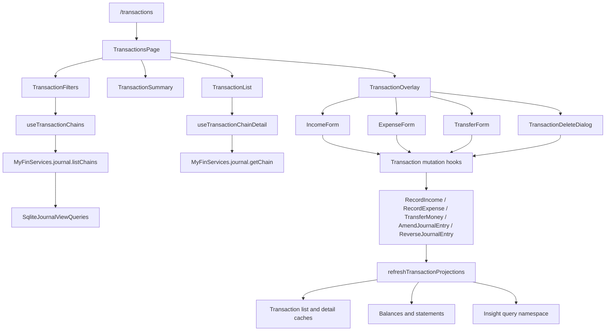
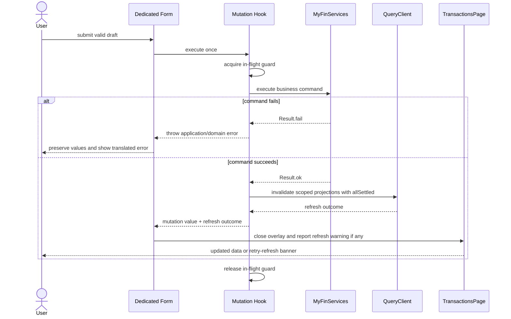

# Ciclo de Vida de Transações e Transferências - Design

**Spec:** `.specs/features/transaction-lifecycle/spec.md`
**Context:** `.specs/features/transaction-lifecycle/context.md`
**Status:** Aprovado em 2026-09-03

---

## Architecture Overview

A implementação será um módulo vertical único em `apps/tauri/src/features/transactions/`. A página coordena filtros, paginação, expansão e overlays. Os três formulários permanecem componentes dedicados, compartilham apenas campos e validações invariantes e emitem drafts de negócio tipados.

A UI consome somente `MyFinServices`. Nenhum componente acessa repositories, SQLite ou objetos de domínio. `packages/domain` e `packages/application` permanecem inalterados porque já expõem todos os comandos e read models necessários.



### Mutation sequence



---

## Approach Decision

| Approach                                        | Decision | Rationale                                                                                                        |
| ----------------------------------------------- | -------- | ---------------------------------------------------------------------------------------------------------------- |
| Feature-owned orchestrator with dedicated forms | Selected | Keeps the route, state and query lifecycle unified while preserving explicit income, expense and transfer forms. |
| Independent income, expense and transfer slices | Rejected | Recreates the fragmentation of the sibling project and duplicates mutation and invalidation behavior.            |
| One polymorphic form                            | Rejected | Concentrates conditional behavior and weakens the confirmed requirement for dedicated forms.                     |

This is a feature-local decision. It does not establish a new project-wide architecture decision, so no entry is added to `.specs/STATE.md`.

---

## Code Reuse Analysis

### Existing Components and Contracts to Leverage

| Component or contract                                                    | Location                                                              | How to use                                                                                                                                 |
| ------------------------------------------------------------------------ | --------------------------------------------------------------------- | ------------------------------------------------------------------------------------------------------------------------------------------ |
| `MyFinServices`                                                          | `apps/tauri/src/bootstrap/create-services.ts`                         | Consume the existing journal, income, expenses, transfers, accounts, categories and books services.                                        |
| Active book provider                                                     | `apps/tauri/src/providers/`                                           | Scope queries, commands and UI state to the current `bookId`.                                                                              |
| `useBooks`                                                               | `apps/tauri/src/features/books/hooks/`                                | Resolve the active book currency and detect an unavailable book.                                                                           |
| `useAccountBalances`                                                     | `apps/tauri/src/features/accounts/hooks/use-account-balances.ts`      | Supply active ASSET/LIABILITY options and current account names.                                                                           |
| `useIncomeCategories`                                                    | `apps/tauri/src/features/categories/hooks/use-income-categories.ts`   | Supply valid income category options.                                                                                                      |
| `useExpenseCategories`                                                   | `apps/tauri/src/features/categories/hooks/use-expense-categories.ts`  | Supply valid expense category options.                                                                                                     |
| `accountKeys`                                                            | `apps/tauri/src/features/accounts/hooks/account-keys.ts`              | Invalidate balances and affected account statements.                                                                                       |
| Existing invalidation helpers                                            | `apps/tauri/src/features/query-invalidation.ts`                       | Extend the current pattern with transaction and insight namespaces and a non-throwing refresh outcome.                                     |
| `Sheet`                                                                  | `packages/ui/src/components/sheet.tsx`                                | Host create, edit and delete flows with Base UI focus management. Use full width on small screens and a constrained right panel from `sm`. |
| `DropdownMenu`                                                           | `packages/ui/src/components/dropdown-menu.tsx`                        | Present exactly Receita, Despesa and Transferência from the primary action.                                                                |
| `MoneyInput` and `FormattedMoney`                                        | `packages/ui/src/money/`                                              | Parse positive minor units and format BigInt-safe currency values.                                                                         |
| `Field`, `Input`, `Button`, `Alert`, `Skeleton`, `Spinner`, `EmptyState` | `packages/ui/src/components/`                                         | Build forms and explicit loading, error and empty states.                                                                                  |
| `JournalChainListItem` and `JournalChainDetail`                          | `packages/application/src/ports/journal-view-queries.ts`              | Use the consolidated chain as the only list/detail view model.                                                                             |
| `JournalBusinessDraft`                                                   | `packages/application/src/ports/commands.ts`                          | Use discriminated drafts as the form-to-container boundary for editing.                                                                    |
| `ListJournalChains`                                                      | `packages/application/src/ledger/queries/list-journal-chains.ts`      | Query filtered pages with the opaque cursor contract.                                                                                      |
| `GetJournalChainDetail`                                                  | `packages/application/src/ledger/queries/get-journal-chain-detail.ts` | Load current presented entry, postings and audit history on demand.                                                                        |
| Ledger command use cases                                                 | `packages/application/src/ledger/journal/`                            | Execute creation, amendment and reversal without reproducing business rules in React.                                                      |

### Patterns Adopted from the References

| Reference            | Adopted                                                                                                              | Not copied                                                                                                   |
| -------------------- | -------------------------------------------------------------------------------------------------------------------- | ------------------------------------------------------------------------------------------------------------ |
| `Suares01/open-coin` | Dedicated forms, disabled retry, in-flight guard, command mapping, explicit error states and append-only maintenance | Separate top-level feature directories, TanStack Router routes and OpenCoin naming                           |
| `shadcn-fintech`     | Summary → filters → responsive list, expandable rows and strong value hierarchy                                      | Seed data, merchant fields, remote payment statuses, CSV selection/export, receipts and Next.js dependencies |

### Integration Points

| System                 | Integration method                                                                                                  |
| ---------------------- | ------------------------------------------------------------------------------------------------------------------- |
| React Router           | Add a child route `transactions` under `ApplicationShell`.                                                          |
| Sidebar and breadcrumb | Add `{ label: "Transações", href: "/transactions" }` to `sidebarData`; `AutoBreadcrumb` derives the labels from it. |
| TanStack Query         | Introduce transaction query keys, infinite list query, lazy detail query and scoped mutation refresh.               |
| Application services   | Call only the existing public use cases from `useMyFin()`.                                                          |
| SQLite                 | No direct integration or schema change; access remains behind the application query/use-case layer.                 |

---

## Feature Structure

```text
apps/tauri/src/features/transactions/
├── components/
│   ├── transactions-page.tsx
│   ├── transaction-summary.tsx
│   ├── transaction-filters.tsx
│   ├── transaction-list.tsx
│   ├── transaction-row-details.tsx
│   ├── transaction-overlay.tsx
│   ├── transaction-delete-dialog.tsx
│   ├── transaction-form-fields.tsx
│   ├── income-form.tsx
│   ├── expense-form.tsx
│   ├── transfer-form.tsx
│   └── index.ts
├── hooks/
│   ├── transaction-keys.ts
│   ├── use-transaction-chains.ts
│   ├── use-transaction-chain-detail.ts
│   ├── use-transaction-form-options.ts
│   ├── use-transaction-mutations.ts
│   └── index.ts
├── transaction-form-model.ts
├── transaction-list-model.ts
└── index.ts
```

Tests stay beside the unit under test using the current `*.test.ts` and `*.test.tsx` convention.

---

## Components

### `TransactionsPage`

- **Purpose:** Own the book-scoped screen state and compose summary, filters, list and overlay.
- **Location:** `apps/tauri/src/features/transactions/components/transactions-page.tsx`
- **State:** `TransactionFilters`, expanded `chainId`, `TransactionOverlayState` and projection refresh warning.
- **Interfaces:** No public props; the route renders the component.
- **Dependencies:** `useActiveBook`, `useTransactionChains`, list-model selectors and child components.
- **Behavior:** Key the book-scoped content by active `bookId`. A book change unmounts the old state, closes overlays and prevents late results from mutating the new screen.
- **Reuses:** Loading/error composition from `AccountsPage` and `CategoriesPage`.

### `TransactionSummary`

- **Purpose:** Calculate and render income, expense, largest absolute amount and count for locally visible loaded chains.
- **Location:** `apps/tauri/src/features/transactions/components/transaction-summary.tsx`
- **Interface:** `TransactionSummary({ items }: { items: readonly JournalChainListItem[] })`.
- **Rules:** Use `BigInt` for every calculation. Income and expense contribute only to their own totals. Transfer contributes to count and largest, but not to income or expense totals.
- **Presentation:** Every card includes the qualifier `resultados carregados`.
- **Reuses:** `Card`, `FormattedMoney` and Lucide icons.

### `TransactionFilters`

- **Purpose:** Edit server-supported filters and the local-only chain status filter.
- **Location:** `apps/tauri/src/features/transactions/components/transaction-filters.tsx`
- **Interface:** Controlled `filters`, `accounts`, `categories`, `onChange` and `onClear` props.
- **Server filters:** `from`, `to`, `search`, `types`, `accountIds`, `categoryIds`.
- **Local filter:** `status` with `ALL`, `ACTIVE`, `EDITED` and `CANCELLED`.
- **Behavior:** Any server-filter change creates a new list query key and therefore restarts pagination. A status-only change preserves loaded pages.
- **Accessibility:** Native labels, `aria-pressed` for type/status toggles and keyboard-operable native date/select controls.
- **Reuses:** `Input`, `Button`, `ToggleGroup` and native `select`/`input type="date"` elements styled with existing tokens.

### `TransactionList`

- **Purpose:** Render the consolidated rows and own no remote state.
- **Location:** `apps/tauri/src/features/transactions/components/transaction-list.tsx`
- **Interface:** Items, expanded chain ID, loading-more state, next-page availability and callbacks.
- **Desktop:** Semantic table at `lg` with context, value, date, status and actions.
- **Mobile/tablet:** Stacked semantic list below `lg`; no required horizontal scroll.
- **Behavior:** The row expansion control is a real button. Actions never depend on hover.
- **Empty states:** Distinguish no book transactions from no locally visible result. If a status filter hides the loaded page while another server page exists, keep `Carregar mais resultados` available.
- **Reuses:** `EmptyState`, `Button`, `Spinner` and `FormattedMoney`.

### `TransactionRowDetails`

- **Purpose:** Load and render current chain detail only while a row is expanded or an operation needs current data.
- **Location:** `apps/tauri/src/features/transactions/components/transaction-row-details.tsx`
- **Interface:** `chainId`, `presentedEntryId`, `status`, and callbacks for edit/delete.
- **Data:** `useTransactionChainDetail` returns `JournalChainDetail` with postings and history.
- **Actions:** Offer edit/delete for `ACTIVE` and `EDITED`; omit them for `CANCELLED`.
- **Concurrency:** Pass the detail's current `presentedEntryId` and `presentedVersion` into the overlay, never a stale version captured before the detail query.
- **Reuses:** `Alert`, `Skeleton`, `Button` and application view types.

### `TransactionOverlay`

- **Purpose:** Render exactly one create, edit or delete surface from a discriminated overlay state.
- **Location:** `apps/tauri/src/features/transactions/components/transaction-overlay.tsx`
- **Interface:** Controlled `state`, `onClose`, `onMutationSuccess` and `onRefreshFailure`.
- **Presentation:** Use `SheetContent side="right"` with `w-full sm:max-w-xl`; scroll only the content region. This is the confirmed responsive dialog implementation.
- **Focus:** Base UI owns focus trap and restoration. Titles and descriptions are always supplied.
- **Book change:** Parent reset closes it. Success handlers compare the submitted `bookId` with the current active book before changing local page state.

### Dedicated Forms

- **Purpose:** Own field state, validation and type-specific draft construction.
- **Locations:** `income-form.tsx`, `expense-form.tsx`, `transfer-form.tsx`.
- **Shared interface shape:**

```typescript
interface TransactionFormProps<TDraft extends JournalBusinessDraft> {
  readonly initialDraft?: TDraft
  readonly pending: boolean
  readonly submitError?: string
  readonly onSubmit: (draft: TDraft) => Promise<void>
  readonly onCancel: () => void
}
```

- **Income:** Emits `Extract<JournalBusinessDraft, { type: "INCOME" }>`.
- **Expense:** Emits `Extract<JournalBusinessDraft, { type: "EXPENSE" }>`.
- **Transfer:** Emits `Extract<JournalBusinessDraft, { type: "TRANSFER" }>` and rejects equal source/destination IDs.
- **Options:** `useTransactionFormOptions(type)` provides the active book, financial accounts and only the relevant category family.
- **Shared fields:** `TransactionFormFields` contains value, local date and description controls. Account/category controls remain explicit in each dedicated form.
- **Editing:** `initialDraft` is produced from the freshly loaded `JournalChainDetail`. The type is fixed and not rendered as an editable field.
- **Missing dependencies:** Render guidance links to `/accounts` or `/categories`; do not render a form that cannot succeed.
- **Reuses:** `react-hook-form`, Zod, `MoneyInput`, `Field`, `Input`, `Alert`, `Spinner` and current form conventions.

### `TransactionDeleteDialog`

- **Purpose:** Confirm the user-facing exclusion and submit a reversal.
- **Location:** `apps/tauri/src/features/transactions/components/transaction-delete-dialog.tsx`
- **Interface:** Current `JournalChainDetail`, pending/error state, `onConfirm` and `onCancel`.
- **Fields:** Local cancellation date and a system-derived description such as `Cancelamento de: <descrição>`.
- **Validation:** The date must be a valid `YYYY-MM-DD` and cannot precede `detail.occurredOn`.
- **Presentation:** Reuse the responsive `Sheet`; destructive copy states that history remains preserved.
- **Behavior:** Keep the row visible and the overlay open until service success. No optimistic cache removal.

---

## Hooks and Query Cache

### Query keys

```typescript
type TransactionType = Exclude<JournalBusinessType, "OPENING_BALANCE">

const transactionKeys = {
  all: (bookId: string) => ["books", bookId, "transactions"] as const,
  lists: (bookId: string) => [...transactionKeys.all(bookId), "list"] as const,
  list: (bookId: string, filters: TransactionServerFilters) =>
    [...transactionKeys.lists(bookId), filters] as const,
  details: (bookId: string) =>
    [...transactionKeys.all(bookId), "detail"] as const,
  detail: (bookId: string, chainId: string) =>
    [...transactionKeys.details(bookId), chainId] as const,
}
```

`TransactionServerFilters` is normalized before entering the key: strings are trimmed, empty fields are omitted and ID/type arrays are unique and sorted. Status is excluded because the application query does not accept it.

### `useTransactionChains`

- **Location:** `apps/tauri/src/features/transactions/hooks/use-transaction-chains.ts`
- **Implementation:** `useInfiniteQuery<QueryPage<JournalChainListItem>>`.
- **Fixed query values:** Active `bookId`, page size `20`, and types restricted to the selected subset of `INCOME`, `EXPENSE`, `TRANSFER`.
- **Cursor:** Pass only the `nextCursor` returned by the previous page.
- **Selection:** Flatten pages and deduplicate by `chainId` while preserving server order.
- **Recovery:** If a paginated request fails with an invalid cursor, retain filters, remove the cached paginated query and request its first page again.
- **No retry:** Application validation and cursor failures are not automatically retried.

### `useTransactionChainDetail`

- **Location:** `apps/tauri/src/features/transactions/hooks/use-transaction-chain-detail.ts`
- **Key:** Stable by `bookId` and `chainId`.
- **Query input:** Use the latest list item's `presentedEntryId`; `GetJournalChainDetail` accepts an entry within the chain.
- **Enablement:** Only while expanded or while preparing an edit/delete action.
- **Not found:** Convert `Result.fail` or an absent detail to the same explicit detail error state.
- **Refresh:** Amendment and reversal invalidate the chain key. A concurrency conflict explicitly refetches both detail and list before re-enabling submit.

### Mutation hooks

- **Location:** `apps/tauri/src/features/transactions/hooks/use-transaction-mutations.ts`
- **Exports:** `useRecordIncome`, `useRecordExpense`, `useTransferMoney`, `useAmendTransaction`, `useReverseTransaction`.
- **Guard:** Every hook has a synchronous `useRef` in-flight guard in addition to `isPending`.
- **Retry:** `retry: false` for every mutation.
- **Command mapping:**
  - Create income/expense: strip the draft discriminator and call the respective `JournalEntryCommand` service.
  - Create transfer: map to `TransferMoneyCommand`.
  - Edit: combine current `bookId`, `presentedEntryId`, `presentedVersion` and the same-type draft into `AmendJournalEntryCommand`.
  - Delete: combine current identity/version, validated date and derived description into `ReverseJournalEntryCommand`.
- **Affected accounts:** Refresh the union of old and new financial account IDs for amendment; refresh current financial accounts for reversal; refresh submitted accounts for creation.
- **Result:** Return both the service value and `ProjectionRefreshOutcome`. Projection refresh failure never changes a successful ledger command into a failed command.

### Projection refresh

Extend `apps/tauri/src/features/query-invalidation.ts` with:

```typescript
interface ProjectionRefreshOutcome {
  readonly ok: boolean
  readonly failedScopes: readonly (
    | "transactions"
    | "balances"
    | "statements"
    | "insights"
  )[]
}

async function refreshTransactionProjections(
  queryClient: QueryClient,
  input: {
    readonly bookId: string
    readonly chainId?: string
    readonly accountIds: readonly string[]
  }
): Promise<ProjectionRefreshOutcome>
```

The helper uses `Promise.allSettled` for these scopes:

1. `transactionKeys.lists(bookId)` with `exact: false`.
2. `transactionKeys.detail(bookId, chainId)` when a chain is known.
3. `accountKeys.balances(bookId)`.
4. `accountKeys.statement(bookId, accountId)` for every unique affected account.
5. `["books", bookId, "insights"]` with `exact: false`.

The UI closes a successfully completed mutation and displays a page-level warning with `Atualizar agora` when any scope fails. That action repeats only cache invalidation/refetch; it never repeats the ledger command.

---

## Data Models

### Filter state

```typescript
type TransactionType = Exclude<JournalBusinessType, "OPENING_BALANCE">
type TransactionStatusFilter = "ALL" | JournalChainStatus

interface TransactionFilters {
  readonly from: string
  readonly to: string
  readonly search: string
  readonly types: readonly TransactionType[]
  readonly accountIds: readonly string[]
  readonly categoryIds: readonly string[]
  readonly status: TransactionStatusFilter
}

interface TransactionServerFilters {
  readonly from?: string
  readonly to?: string
  readonly search?: string
  readonly types: readonly TransactionType[]
  readonly accountIds?: readonly string[]
  readonly categoryIds?: readonly string[]
}
```

The default `types` value is all three supported transaction types. An empty type selection is rejected by the UI and restored to all types because the application contract treats an empty array as invalid.

### Infinite list selection

```typescript
type TransactionChainsData = InfiniteData<
  QueryPage<JournalChainListItem>,
  string | undefined
> & {
  readonly items: readonly JournalChainListItem[]
  readonly nextCursor: string | null
}
```

The selector deduplicates by `chainId`. `presentedEntryId` is intentionally not the identity because amendments replace the presented entry while preserving the chain.

### Overlay state

```typescript
type TransactionOverlayState =
  | { readonly kind: "CLOSED" }
  | { readonly kind: "CREATE"; readonly type: TransactionType }
  | {
      readonly kind: "EDIT"
      readonly chainId: string
      readonly detail: JournalChainDetail
    }
  | {
      readonly kind: "DELETE"
      readonly chainId: string
      readonly detail: JournalChainDetail
    }
```

A discriminated state prevents multiple forms or confirmations from being open simultaneously.

### Form drafts

The forms emit existing `JournalBusinessDraft` variants. No parallel UI DTO is created after validation. Raw input state may contain `amountDisplay` and nullable `amountMinor`, but only a valid application draft crosses the form boundary.

### Refresh outcome

```typescript
interface TransactionMutationResult<T> {
  readonly value: T
  readonly refresh: ProjectionRefreshOutcome
  readonly submittedBookId: string
}
```

This separates durable command success from disposable cache refresh failure and supports `TXL-59` without retrying a command.

---

## List and Form Model Rules

### Amount presentation

- `JournalChainListItem.amountMinor` is an unsigned business magnitude for all three included types.
- Display `+` for `INCOME`, `-` for `EXPENSE` and no sign for `TRANSFER`.
- Summary income includes only `INCOME`; summary expense includes only `EXPENSE`.
- Largest compares absolute `BigInt` magnitudes across the visible items.
- Every formatted value uses the item's `currency`; the active book contract keeps the loaded set in one base currency.

### Initial edit drafts

- Income uses the single INCOME category and the financial account from the detail.
- Expense uses the single EXPENSE category and the financial account from the detail.
- Transfer uses `detail.transfer.source` and `detail.transfer.destination`.
- Amount, occurrence date, description and currency come from the presented detail.
- If the detail cannot produce an unambiguous same-type draft, editing is blocked with a data-integrity alert; no arbitrary account is chosen.

### Date handling

- Use local calendar functions that construct and format `YYYY-MM-DD` without converting through UTC for display.
- Creation defaults to the current local civil date.
- Cancellation defaults to the current local civil date and validates `date >= detail.occurredOn`.
- The application remains authoritative and may reject a date that became invalid relative to refreshed state.

---

## Error Handling Strategy

| Error scenario                                          | Handling                                                                                       | User impact                                                                  |
| ------------------------------------------------------- | ---------------------------------------------------------------------------------------------- | ---------------------------------------------------------------------------- |
| Initial chain query fails                               | Keep page header, show destructive `Alert`, expose `Tentar novamente`                          | Failure is distinct from an empty ledger.                                    |
| Later page fails                                        | Preserve loaded rows and expose retry beside `Carregar mais`                                   | Existing context is not discarded.                                           |
| Invalid cursor                                          | Reset only the list cache for current filters and reload page one                              | Filters remain selected; no stale cursor loop.                               |
| Missing active book                                     | Disable query/form execution and show book-selection guidance                                  | No command is built with a placeholder book ID.                              |
| Missing/archived account or category                    | Translate `ENTITY_NOT_FOUND` or `INVALID_ACCOUNT_STATUS`, refetch options                      | Form values remain; stale option must be corrected.                          |
| Invalid account kind or same transfer account           | Attach the translated domain error to the related selector                                     | Form remains open.                                                           |
| Invalid amount/date/description                         | Reject in Zod before command construction                                                      | Field-level message and focusable invalid control.                           |
| `OPTIMISTIC_CONCURRENCY_FAILURE`                        | Lock resubmission, refetch list/detail, then require explicit resubmit                         | User sees that the transaction changed; no overwrite occurs.                 |
| `JOURNAL_ENTRY_NOT_EFFECTIVE` or already reversed       | Refresh detail and remove invalid actions                                                      | UI converges to the terminal/current chain state.                            |
| Command fails before commit                             | Keep overlay and values; show translated error                                                 | No success feedback or cache removal.                                        |
| Command succeeds and projection refresh partially fails | Close overlay, show page warning and retry only refresh                                        | Durable success is not misreported as failure and command is not duplicated. |
| Mutation resolves after book switch                     | Invalidate caches by submitted `bookId`; ignore page-local success for a different active book | The new book does not receive stale UI state.                                |
| Detail cannot map to one same-type draft                | Block edit and show integrity error; deletion remains available if the chain is effective      | No silent or guessed account/category selection.                             |

Error translation lives in `transaction-form-model.ts` and switches on real codes from the current domain/application, including `ENTITY_NOT_FOUND`, `INVALID_ACCOUNT_KIND`, `INVALID_ACCOUNT_STATUS`, `SAME_TRANSFER_ACCOUNT`, `CURRENCY_MISMATCH`, `NON_POSITIVE_AMOUNT`, `REVERSAL_DATE_BEFORE_ORIGINAL`, `JOURNAL_ENTRY_NOT_EFFECTIVE` and `OPTIMISTIC_CONCURRENCY_FAILURE`. Unknown errors use an action-specific fallback and never expose stack traces.

---

## Responsive and Accessibility Design

| Width          | Layout                                                                                                      |
| -------------- | ----------------------------------------------------------------------------------------------------------- |
| `< 640px`      | Two-column summary cards, stacked filters, transaction cards, full-width actions and full-width Sheet.      |
| `640px–1023px` | Two/four summary columns as space permits, wrapped filters, stacked transaction rows and constrained Sheet. |
| `>= 1024px`    | Four summary cards, single filter toolbar where possible and semantic table.                                |

- The desktop row and mobile card render from the same `JournalChainListItem` view model.
- Expansion buttons expose `aria-expanded` and `aria-controls`.
- Status is conveyed by text and color, never color alone.
- Loading regions use `aria-busy`; errors and refresh warnings use `aria-live="polite"`.
- Sheets always have title and description. Base UI handles initial focus, containment, Escape and focus restoration.
- Destructive confirmation requires an explicit button. Closing or pressing Escape does not execute reversal.
- Hidden desktop/mobile variants must not duplicate focusable controls in the accessibility tree; render one variant by CSS only when the hidden primitive guarantees `display: none`, otherwise choose the variant through the existing mobile hook.

---

## Testing Strategy

### Pure model tests

- Normalize server filters and keep status out of the service query.
- Deduplicate infinite pages by `chainId` while preserving server order.
- Filter status only across loaded items.
- Calculate BigInt summaries and transfer-neutral totals.
- Convert each detail type to one unambiguous same-type edit draft.
- Validate value bounds, civil dates, description trim and distinct transfer accounts.
- Derive affected account ID unions for create, amendment and reversal.

### Hook tests

- Assert exact `ListJournalChains` input, page size, fixed type boundary and cursor propagation.
- Assert invalid cursor recovery without losing filters.
- Assert detail enablement and exact `GetJournalChainDetail` input.
- Assert every mutation's exact application command.
- Assert synchronous in-flight rejection and `retry: false`.
- Seed list/detail/balance/statement/insight query keys and assert scoped invalidation.
- Force one invalidation rejection and assert successful command plus failed refresh outcome.
- Switch active books during a pending mutation and assert only the submitted book's cache is invalidated.

### Component tests

- Cover initial loading, initial error, empty ledger and empty filtered results.
- Render income, expense and transfer rows with exact signs and contexts.
- Cover create type selection and exactly one open form.
- Cover each form's valid payload, validation, missing dependencies and retained values on failure.
- Cover edit prefilling, same-type amendment and conflict refresh gate.
- Cover delete explanation, date guard, no optimistic removal and terminal actions.
- Cover keyboard expansion, dialog focus behavior and action access without hover.
- Assert mobile/tablet/desktop content contracts at 375 px, 768 px and 1280 px.

### Integration and regression gates

- Router test proves `/transactions` renders inside `ApplicationShell` and sidebar/breadcrumb metadata match.
- Existing domain and application suites remain green; they remain the proof for atomic amendment/reversal invariants.
- Existing SQLite journal view tests remain green; new UI tests consume their public read-model shape instead of duplicating SQL expectations.
- Package-level typecheck, lint, Vitest and Tauri build run before feature completion.
- Interactive UAT covers one full create → edit → delete journey for each transaction type because the feature is user-facing and stateful.

---

## Risks & Concerns

| Concern                                                                                               | Location                                                    | Impact                                                                            | Mitigation                                                                                                                                            |
| ----------------------------------------------------------------------------------------------------- | ----------------------------------------------------------- | --------------------------------------------------------------------------------- | ----------------------------------------------------------------------------------------------------------------------------------------------------- |
| Status is absent from the application query input                                                     | `packages/application/src/ports/journal-view-queries.ts:46` | A status filter cannot describe the entire ledger while pages remain unloaded.    | Keep it explicitly local, label the loaded-results boundary and preserve load-more even when the local result is empty.                               |
| Existing journal mutation invalidation does not target a transaction list/detail or insight namespace | `apps/tauri/src/features/query-invalidation.ts:27`          | Successful mutations can leave the new screen and future insights stale.          | Add `transactionKeys` and `refreshTransactionProjections`; verify every cache scope with seeded query tests.                                          |
| Awaited invalidation can be mistaken for command failure                                              | `apps/tauri/src/features/query-invalidation.ts:34`          | Retrying after a committed command could create a duplicate transaction.          | Use `Promise.allSettled` and return a separate refresh outcome; retry only projection refresh.                                                        |
| The shared UI package has no Table, Select, Calendar, Badge or AlertDialog wrapper                    | `packages/ui/package.json:46`                               | Porting the template directly would expand the shared package and increase scope. | Use semantic HTML/native controls, feature-owned status presentation and the existing Base UI-backed `Sheet`.                                         |
| The current Sheet defaults to a 75% side width and has English close assistive text                   | `packages/ui/src/components/sheet.tsx:37`                   | Mobile form width and accessible language would miss the confirmed experience.    | Override width in the transaction overlay and supply a localized close control or localize the shared sr-only label in a separately tested UI change. |
| The list item exposes arrays for financial accounts/categories                                        | `packages/application/src/ports/journal-view-queries.ts:18` | A malformed or unexpected projection could make edit prefilling ambiguous.        | Build edit drafts from fresh detail and block editing unless the type-specific mapping is unambiguous.                                                |
| `presentedEntryId` changes after amendment while `chainId` is stable                                  | `packages/application/src/ports/journal-view-queries.ts:19` | Caching details by entry ID can strand stale chain history.                       | Key detail cache by `chainId`, execute with the latest presented ID and invalidate by stable chain identity.                                          |
| Transaction UI tests do not exist yet                                                                 | `apps/tauri/src/routes/app-routes.tsx:9`                    | The feature would otherwise rely only on lower-layer coverage.                    | Create spec-derived model, hook, component and router tests before corresponding implementation.                                                      |
| The worktree already contains unrelated UI and routing changes                                        | `apps/tauri/src/layout/app-shell.tsx:1`                     | Broad formatting or overlapping rewrites can damage user work.                    | Patch only the transaction navigation entries and preserve all unrelated modifications; verify scoped diffs per task.                                 |

---

## Tech Decisions

| Decision                   | Choice                                                                       | Rationale                                                                                  |
| -------------------------- | ---------------------------------------------------------------------------- | ------------------------------------------------------------------------------------------ |
| Feature boundary           | One `transactions` module                                                    | Matches the confirmed unified product surface.                                             |
| Form architecture          | Three dedicated forms emitting existing discriminated drafts                 | Keeps type rules explicit and reuses one edit command contract.                            |
| List identity              | `chainId`                                                                    | Stable across amendments and reversals.                                                    |
| Operational identity       | Fresh `presentedEntryId` plus `presentedVersion`                             | Targets the current effective journal entry and preserves optimistic concurrency.          |
| Detail loading             | Lazy on expansion/action                                                     | Avoids an N+1 detail request for every row.                                                |
| Status filtering           | Client-side over loaded chains                                               | Application query has no status field and the limitation is confirmed in the spec.         |
| Pagination                 | `useInfiniteQuery`, 20 items, opaque cursor                                  | Matches the application contract and existing account-statement pattern.                   |
| Responsive overlay         | Existing Base UI-backed `Sheet`                                              | Supplies focus management without widening the shared component library.                   |
| Select and date controls   | Native semantic controls styled locally                                      | Avoids adding unrelated shared primitives while retaining keyboard/accessibility behavior. |
| Money arithmetic           | String at boundaries, `BigInt` for calculation, shared formatter for display | Avoids precision loss and matches application contracts.                                   |
| Mutation retries           | Disabled plus synchronous in-flight guard                                    | Prevents duplicate ledger commands.                                                        |
| Refresh failure            | Separate successful command result from cache refresh outcome                | Never asks the user to repeat a command that may already be committed.                     |
| Domain/application changes | None                                                                         | Existing public use cases and read models cover the confirmed feature.                     |

---

## Requirement Coverage

| Design area                                   | Requirements                                              |
| --------------------------------------------- | --------------------------------------------------------- |
| Route, shell and page state                   | `TXL-01`, `TXL-54`, `TXL-58`                              |
| Consolidated list and detail                  | `TXL-02`–`TXL-10`, `TXL-25`, `TXL-31`, `TXL-32`, `TXL-38` |
| Creation forms and commands                   | `TXL-11`–`TXL-24`, `TXL-55`–`TXL-57`                      |
| Amendment                                     | `TXL-25`–`TXL-31`                                         |
| Reversal-backed deletion                      | `TXL-32`–`TXL-40`                                         |
| Filters and cursor pagination                 | `TXL-41`–`TXL-46`                                         |
| Summary, amounts and responsive accessibility | `TXL-47`–`TXL-53`                                         |
| Projection refresh failure                    | `TXL-22`, `TXL-28`, `TXL-38`, `TXL-59`                    |

**Coverage:** 59 of 59 requirements are mapped to at least one design area. Task mapping remains pending until this design is approved.
